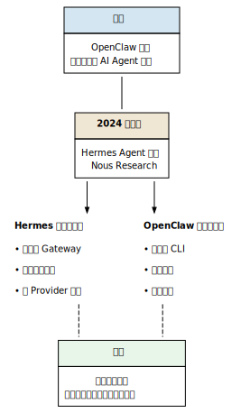

# 第1章：认识 Hermes Agent {#ch:1}

## 1.1 什么是 Hermes Agent？

Hermes Agent 是由 **Nous Research** 开发的开源 AI 代理框架，基于 Apache-2.0 许可证发布。它的核心是一个**能够使用工具的 AI 对话系统**——不是简单的 Chatbot，而是一个可以执行命令、读写文件、搜索网页、调用 API、运行代码的自主代理。

> **一句话描述：** Hermes Agent 是一个跑在你电脑上的 AI 助手，它能理解你的自然语言指令，然后调用各种工具来完成你的任务。

### 它能做什么？

一个配置好的 Hermes Agent 可以：

- 操作终端——安装软件包、编译代码、管理服务
- 读写文件——创建项目、修改配置、分析日志
- 搜索网络——查询文档、调研技术方案
- 操作 Git——提交代码、创建 PR、管理分支
- 发送消息——通过 QQ、钉钉、Telegram、Matrix 等平台给你推送通知
- 定时任务——每天早上给你推送日报，或定时检查服务器健康
- 记住你——跨会话记忆你的偏好、项目约定和已知解决方案
- 学习进化——通过 Skills 机制保存工作流程，越用越顺手

### 谁来用它？

- **开发者**：代码审查、自动化测试、项目管理
- **运维人员**：服务器监控、日志分析、故障排查
- **研究者**：文献检索、数据处理、实验管理
- **内容创作者**：写作辅助、素材整理、知识管理

### 纯对话模式 vs Agent 模式

与传统 AI 聊天工具（如 ChatGPT 网页版）不同，Hermes Agent 工作在 **Agent 模式**——它可以调用工具来影响外部世界：

| | 纯对话（ChatGPT） | Hermes Agent |
|:--|:-----------------|:-------------|
| 能不能运行命令？ | 否 | 是：`terminal()` |
| 能不能本地读写？ | 否 | 是：`read_file()` / `write_file()` |
| 能不能联网搜索？ | 需手动开启 | 是：`web_search()` |
| 能不能记住上次会话？ | 上下文窗口 | 是：持久记忆 |
| 能不能定时自动执行？ | 否 | 是：Cron 任务 |

## 1.2 Hermes Agent 与 OpenClaw：历史渊源

OpenClaw 是 Hermes Agent 的前身。Hermes Agent 最初是 OpenClaw 的一个**分支（fork）**，但随着 Nous Research 团队的推动，两个项目在设计理念上逐渐分化。

### 发展时间线

### 为什么选择 Hermes？

| 维度 | OpenClaw | Hermes Agent |
|:-----|:---------|:-------------|
| 开发者 | 社区驱动 | Nous Research 主导 |
| 设计哲学 | 极简、本地优先 | 全功能、企业级 |
| 跨平台通信 | CLI 为主 | 15+ 平台 Gateway（QQ/钉钉/Telegram/Matrix 等） |
| 外部记忆 | 有限（上下文窗口） | 多层次记忆系统（Holographic Memory） |
| 多模型协作 | 单模型 | 多 Provider 路由，子代理独立模型 |
| Provider 支持 | 有限 | 20+ Provider，支持 Credential Pool |
| Skills 机制 | 无 | 成熟的技能库，Agent 自我改进 |
| Cron 任务 | 无 | 内置调度器，多平台投递 |
| Profiles | 无 | 多环境隔离 |
| 插件系统 | 无 | 插件 + MCP 双重扩展 |
| 资源占用 | 较低 | 中等（功能更多） |

### 如何选择？

- 如果你只需要一个轻量级的 CLI 辅助编码工具，OpenClaw 可能更合适
- 如果你需要**跨平台使用**（在手机上通过 QQ/钉钉控制）、**定时任务自动化**、**多模型调度**、**持久记忆**等企业级功能，**Hermes Agent 是更好的选择**

本教程专为 Hermes Agent 编写。

## 1.3 学完本教程后，你的 Hermes 能做什么？

| 层级 | 能力 | 对应章节 |
|:-----|:-----|:---------|
| 第一卷 | 运行命令、读写文件、搜索网络、编写代码 | [第2章](02-preparation.md#ch:2)～[第5章](05-gateway.md#ch:5) |
| 第一卷 | Gateway 聊天平台配置与开机自启 | [第5章](05-gateway.md#ch:5) |
| 第二卷 | 多模型协作（主模型 + 辅助模型编排） | [第7章](../volume-2/07-multi-model.md#ch:7) |
| 第二卷 | 跨会话持久记忆和深度实体推理 | [第8章](../volume-2/08-memory.md#ch:8) |
| 第二卷 | Gateway 打断行为控制 | [第9章](../volume-2/09-gateway-interrupt.md#ch:9) |
| 第二卷 | 自托管搜索引擎 SearXNG 部署 | [第10章](../volume-2/10-searxng.md#ch:10) |
| 第二卷 | MarkItDown MCP — 文档分析与网页提取 | [第11章](../volume-2/11-markitdown.md#ch:11) |
| 第二卷 | Agent 定制（SOUL 与 Personality） | [第12章](../volume-2/12-agent-customization.md#ch:12) |
| 第三卷 | Astra 生态总览与 Hub 门户 | [第13章](../volume-3/13-astra-intro.md#ch:13)～[第14章](../volume-3/14-astra-hub.md#ch:14) |
| 第三卷 | 登录凭据管理与知识库 | [第15章](../volume-3/15-credentials.md#ch:15)～[第16章](../volume-3/16-knowledge-base.md#ch:16) |
| 第三卷 | 工作原则 Skill 体系与 Plugin 扩展 | [第17章](../volume-3/17-work-principles.md#ch:17)～[第18章](../volume-3/18-plugins.md#ch:18) |
| 第三卷 | MarkItDown 提取后端、Camofox 浏览器自动化 | [第19章](../volume-3/19-markitdown-extract.md#ch:19)～[第20章](../volume-3/20-camofox.md#ch:20) |
| 第三卷 | Office 工具、SRE 个人运维 | [第21章](../volume-3/21-office-tools.md#ch:21)～[第22章](../volume-3/22-sre.md#ch:22) |
| 第三卷 | **开发者指南**（Plugin 开发与生态贡献） | [第23章](../volume-3/23-developer-guide.md#ch:23) |
| 附录 | 核心概念速览、工具链、配置示例、FAQ | [附录A](../appendix/a-concepts.md#appendix:a)～[附录D](../appendix/d-faq.md#appendix:d) |

---
