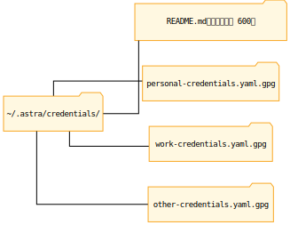
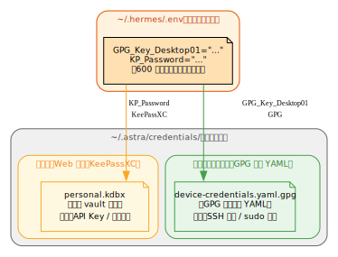

# 第15章：登录凭据管理 {#ch:15}

!!! info "本章对应 Astra 生态组件"
    - KeePassXC — Web 凭据管理
    - GPG-encrypted YAML — 设备凭据管理
    - 两套系统独立运行，各司其职

!!! danger "⚠️ 明文密码警告"
    **任何形式的明文密码都会导致严重后果：**
    
    - **不安全** — 磁盘上的明文密码可被任何能读取文件的进程窃取
    - **被 Hermes 安全层遮蔽** — Hermes 的 credential redaction 会将检测到的密码替换为 `***`，这**会导致 Agent 自动化失败**（密码传入子进程时变成 `***` 字面量）
    - **破坏自动化** — 有 redaction 保护的密码无法用于 SSH 登录、API 调用、sudo 等自动化场景
    
    **正确做法：** 永远使用本章描述的两套凭据管理系统。Hermes 的安全层通过识别 GPG 加密和 KeePassXC 的调用模式，为这些工具提供安全豁免，确保凭据可在自动化中正常使用。

## 15.1 凭据管理的挑战

Hermes Agent 需要访问多种服务：GitHub、API 提供商、服务器 SSH、数据库……这些凭据如何安全地存储和使用？

### 常见问题

- **硬编码**：在脚本或配置文件中写死密码 → 泄露风险
- **环境变量**：在 `.env` 里存明文 → 版本管理时容易误提交
- **交互式输入**：每次都要手动输入 → 无法自动化

## 15.2 两类凭据，两套独立系统

Astra 生态将凭据分为**两大类**，各自使用独立的存储和访问方案：

| 凭据类型 | 典型例子 | 存储系统 | 数据库/目录 | 查询工具 |
|:---------|:---------|:---------|:------------|:---------|
| **Web 登录凭据** | GitHub 密码、API Key、网站账号 | **KeePassXC** | `vault.kdbx` | `keepassxc-cli` |
| **设备登录凭据** | SSH 密码、sudo 密码、服务器信息 | **GPG-encrypted YAML** | `~/.astra/credentials/` | `gpg` + `.env` 口令 |

!!! info "关键区别"
    两套系统相互独立，不存在 GPG 加密 KeePassXC 数据库的"双层"关系。它们分别服务于不同的使用场景。

---

## 15.3 系统一：KeePassXC — Web 登录凭据

KeePassXC 管理所有面向 Web 服务的凭据：

- GitHub 账号密码 / Personal Access Token
- 各类 API 提供商的 API Key（OpenAI、Anthropic、DeepSeek 等）
- 网站登录信息
- 在线数据库连接凭据

### 安装

```bash
# openSUSE
sudo zypper install keepassxc

# Ubuntu/Debian
sudo apt install keepassxc

# Fedora
sudo dnf install keepassxc
```

### 桌面端使用

打开 `<vault>.kdbx` 数据库文件，通过 KeePassXC 图形界面浏览、搜索、复制凭据。

### 命令行查询（无头环境）

Hermes Agent 在无头环境或自动化脚本中通过 `keepassxc-cli` 查询凭据，如：

```bash
# 列出所有条目
keepassxc-cli ls ~/credentials/vault.kdbx

# 搜索 GitHub 相关凭据
keepassxc-cli search ~/credentials/vault.kdbx github

# 显示凭据详情（配合管道使用）
keepassxc-cli show ~/credentials/vault.kdbx -s "github"
```

!!! tip "提示"
    `keepassxc-cli` 在首次调用时需要输入数据库主密码。可配合 `expect` 或密钥文件实现非交互式解锁。

---

## 15.4 系统二：GPG-encrypted YAML — 设备登录凭据 {#sec:15.4}

设备登录凭据（SSH 口令、sudo 密码、服务器连接信息等）使用 **GPG 对称加密的 YAML 文件**存储：

- 远程服务器 SSH 登录密码
- 本地/远端 `sudo` 提权密码
- 服务器主机名、IP、端口、登录方式等结构化信息
- 按分类组织到不同的加密文件中

### 实际部署：~/.astra/credentials/ 目录结构

Astra 生态的实际部署使用了以下布局，按凭据用途分类加密：



### 索引文件（README.md）

每个 `*.yaml.gpg` 文件的用途通过同级 `README.md` 索引说明，遵循**本文件只记录凭证在哪、做什么用，实际密码值在对应的 GPG 加密文件中**的原则：

| 文件 | 内容 | 说明 |
|:----|:-----|:-----|
| `personal-credentials.yaml.gpg` | 个人设备 | 日常设备、NAS、路由器 |
| `work-credentials.yaml.gpg` | 工作设备 | GPU 服务器、BMC 等 |
| `other-credentials.yaml.gpg` | 其他人 | 朋友/家人设备 |

### 文件格式约定

每个 `.yaml.gpg` 文件解密后是标准 YAML 格式，按设备组织：

```yaml
devices:
  - identifier: desktop-01
    hostname: DESKTOP-01
    category: personal
    purpose: "桌面工作站 · 跳板机"
    login:
      method: ssh_key          # SSH key 优先
      fallback: password       # 密码降级
      user: user
      port: 22

  - identifier: nas-01
    hostname: NAS-01
    category: personal
    purpose: "NAS · 存储"
    login:
      method: ssh_key
      fallback: password
      user: admin
      port: 22
```

### 解密方式

GPG 对称加密，加密口令存储在 `~/.hermes/.env` 文件中（如 `GPG_Key_Desktop01`），自动化脚本按需解密：

```bash
#!/bin/bash
# 从 .env 读取加密口令
PASS=$(grep '^export GPG_Key_Desktop01=' ~/.hermes/.env | cut -d= -f3)

# 解密凭据文件（无交互）
echo "$PASS" | gpg --batch --no-tty --passphrase-fd 0 \
  --pinentry-mode loopback \
  --decrypt ~/.astra/credentials/device-credentials.yaml.gpg 2>/dev/null
```

### 非交互式解密（自动化 / Cron）

对于 cron job、后台脚本等自动化场景，此解密方式天然支持无交互运行——口令从 `.env` 读取，不触发 pinentry 弹窗，适合全自动巡检脚本（详见[第22章 SRE](../volume-3/22-sre.md)）。

!!! warning "安全注意"
    `.env` 文件本身包含明文口令，需确保文件权限为 `600`（仅所有者可读写），且不提交到版本管理。

---

## 15.5 两套系统对比总结



!!! info ".env 也用于存储少量明文口令"
    除 API Key 外，`.env` 也可用于存储少量明文口令——例如用于打开加密数据库
    （GPG 解密口令）或加密凭据文件（KeePassXC 主密码）——这些口令无需经过
    pinentry 弹窗，cron 任务可直接从 `.env` 读取。详见[第22章](../volume-3/22-sre.md)的自动化解密说明。

**两个系统独立运行，互不依赖，各管一类凭据。**

---
