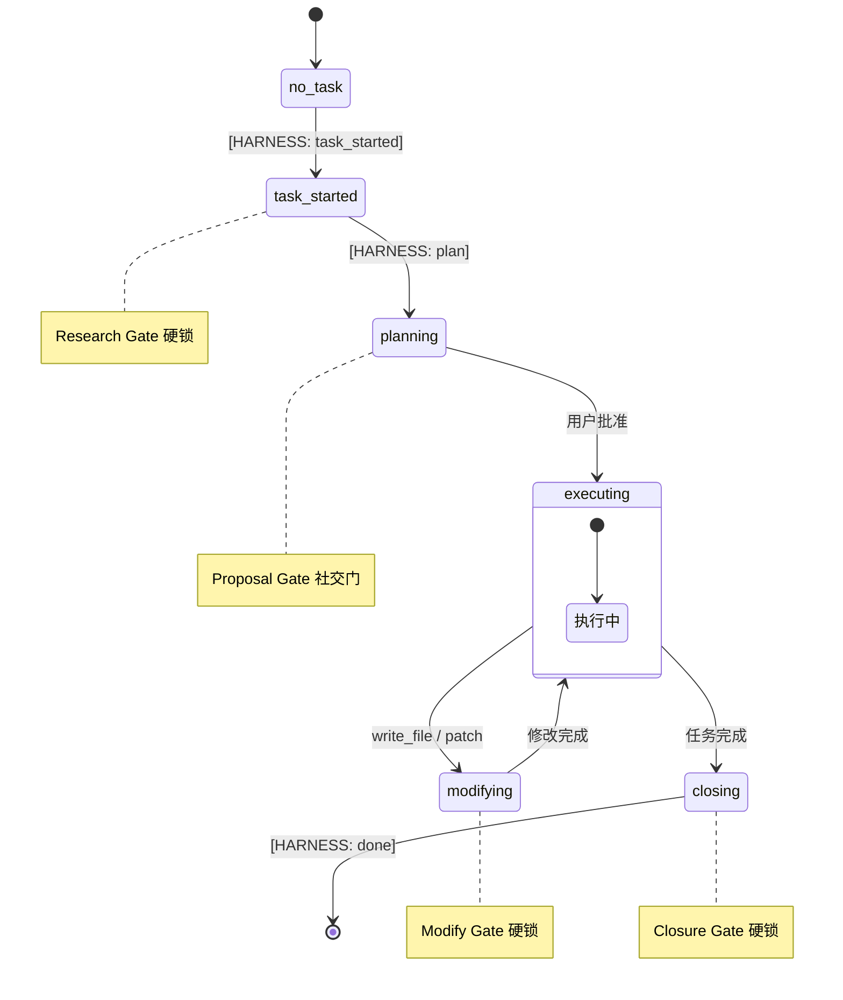

\\newpage

# 第16章：智能体行为约束框架 {#ch:16}

!!! info "本章对应 Astra 生态组件"
    - `work-principles` plugin（位于 `astra-aiagent-infra` 内）
    - `discipline` plugin（位于 `astra-aiagent-infra` 内）

## 16.1 什么是 Harness？

### 16.1.1 通用概念：什么是 Harness？

**Harness**（约束框架）是一种软件架构模式，用于在系统运行时施加边界和规则，约束组件的行为在预定范围内。它与传统的"管理器"或"编排器"不同——Harness 不直接指挥组件做什么，而是定义组件**不能做什么**、**必须按什么顺序做**、以及在偏离时如何**自动纠正**。

典型的 Harness 包括：

- **门控机制**（Gates）：在关键路径上设置检查点，只有满足条件才允许通过
- **状态跟踪**：持续追踪系统所处阶段，确保行为与阶段匹配
- **干预/阻断**：当检测到越界行为时自动阻止或发出警告
- **上下文注入**：在每个决策点注入当前阶段所需的指南和约束

### 16.1.2 Agentic Harness 是什么？

**Agentic Harness** 是专门为 AI 智能体（Agent）设计的行为约束框架。LLM 驱动的 Agent 本质上是一个不确定性系统——同样的提示词在不同上下文中可能产生截然不同的行为。Agentic Harness 通过以下方式将不确定性约束在可控范围内：

1. **阶段状态机**（Phase State Machine）—— 定义 Agent 工作的生命周期阶段（调研→计划→执行→修改→关闭），Agent 不能跳过或混用阶段
2. **纪律门**（Discipline Gates）—— 在每个阶段设置不同强度的约束门，从硬阻断到软提醒
3. **标记系统**（Marker System）—— 允许 Agent 通过文本标记自行声明阶段转换
4. **只读白名单**（Read-only Whitelist）—— 在调研和关闭阶段，限制终端命令为只读操作
5. **自动 Skill 加载**（Auto-skill Loading）—— 根据 Agent 使用的工具自动加载对应操作指南

### 16.1.3 本项目中的 Harness：work-principles Plugin 系统

本项目的 Agentic Harness 由 `work-principles` Plugin 实现，包含两个核心插件：

| Plugin | 职责 | 生命周期钩子 |
|:-------|:-----|:------------|
| **discipline** | 阶段状态机 + 工具拦截 | `pre_llm_call`、`pre_tool_call`、`post_tool_call` |
| **context-anchor** | 会话上下文锚定 | `pre_llm_call`、`post_tool_call` |

这两个 Plugin 以 Hermes Agent 的插件钩子机制运行——它们在**每轮 LLM 调用**和**每次工具调用**前后自动触发，不依赖 Agent 是否加载了某个 Skill。这意味着约束是**强制性的**，而非建议性的。

## 16.2 为什么需要 Agentic Harness

LLM 自主 Agent 在带来极大灵活性的同时，也引入了一系列独特的行为风险：

### 16.2.1 Agent 行为风险

| 风险 | 表现 | 后果 |
|:-----|:-----|:-----|
| **跳过调研直接动手** | Agent 收到任务后直接执行 write_file | 在错误的环境修改错误的文件 |
| **未提方案即执行** | 没有征求用户意见就开始操作 | 与用户预期不符，浪费资源 |
| **修改前不做备份** | 直接覆盖关键配置文件 | 无法回滚，数据丢失 |
| **任务结束后不清理** | 遗留 SSH 连接、临时文件、未提交的修改 | 安全风险 + 管理混乱 |
| **阶段混乱** | 一边调研一边修改，边执行边计划 | 上下文碎片化，决策质量下降 |

### 16.2.2 为什么提示词不够

最直观的方案是在系统提示词（System Prompt）中写下行为规则。但实践证明提示词引导存在三个根本缺陷：

1. **不可强制执行**：提示词是建议性的，Agent 可以"忽略"或"遗忘"——尤其在长对话中，模型注意力会偏移
2. **上下文污染**：长篇的行为规则占用宝贵的上下文窗口，与任务相关内容争抢注意力
3. **无状态感知**：提示词无法感知 Agent 当前处于哪个阶段，也就无法施加阶段特定的约束

### 16.2.3 Plugin 钩子方案的优势

Hermes Agent 的 Plugin 系统提供了比提示词更可靠的强制执行层：

| 维度 | 提示词方案 | Plugin 钩子方案 |
|:-----|:----------|:---------------|
| 强制执行 | ❌ 建议性，可忽略 | ✅ 每轮自动触发，不可绕过 |
| 阶段感知 | ❌ 无状态 | ✅ 维护完整状态机 |
| 工具拦截 | ❌ 无法阻止调用 | ✅ `pre_tool_call` 可以阻断违规调用 |
| 上下文效率 | ❌ 持续占用上下文 | ✅ 稳态阶段静默，瞬态阶段注入 |
| 更新维护 | ❌ 需修改系统提示词 + 重启会话 | ✅ 独立更新，即时生效 |

## 16.3 核心架构

Agentic Harness 的核心由五个子系统构成：阶段状态机、纪律门、标记系统、只读白名单和自动 Skill 加载。

### 16.3.1 阶段状态机（Phase State Machine）

状态机定义了 Agent 工作生命的完整周期。阶段分为三类：

**稳态阶段** —— 不注入额外引导，Agent 正常工作：

| 阶段 | 含义 |
|:-----|:------|
| `no_task` | 空闲 / 闲聊，没有活跃任务 |
| `executing` | 执行已批准的计划，日常工作 |

**瞬态阶段** —— 注入阶段相关引导：

| 阶段 | 含义 | 注入内容 |
|:-----|:------|:---------|
| `task_started` | 新任务到达——需要调研 | 先调研、查文档、提方案 |
| `planning` | 调研完成——需要制定计划 | 参考偏好、展示权衡、等待批准 |
| `closing` | 任务完成——需要关闭检查 | 凭证扫描、Skill 更新、决策记录 |

**临时阶段** —— 离开主线流程，完成后返回：

| 阶段 | 含义 | 注入内容 |
|:-----|:------|:---------|
| `accessing_device` | 需要访问凭证 | 检查 GPG 存储、保存新凭证、返回前阶段 |
| `modifying` | 即将修改文件 | 先备份、逐一验证、检查其他位置的同类模式 |

#### 状态转换

Agent 通过 `discipline_set_phase()` 工具主动声明阶段转换。Plugin 仅自动检测 `executing → modifying`（当 Agent 调用 `write_file` 或 `patch` 时）。所有其他转换均由 Agent 驱动。



### 16.3.2 纪律门（Discipline Gates）

每个瞬态/临时阶段配置了不同强度的纪律门：

| 强度级别 | 行为 | 应用门 |
|:---------|:-----|:-------|
| 🔒 硬锁 | 工具被阻断，直到阶段条件满足 | Research Gate、Modify Gate、Closure Gate |
| 👥 社交门 | 不阻断代码，需用户确认 | Proposal Gate（等待"可以"/"开干"） |
| 🪧 提醒 | 注入上下文，不阻断 | Executing 阶段提醒 |
| 📋 检查清单 | 注入完整清单，Agent 必须确认 | Closure Gate 注入 7 步检查清单 |

**Research Gate**（`task_started` 阶段）
- 限制只读工具和终端命令
- 任何写入操作（`write_file`、`patch`）被阻断
- 建议加载 `pre-action-research` Skill

**Proposal Gate**（`planning` 阶段）
- Agent 必须提出包含方案和权衡的计划
- 等待用户明确批准（"可以"/"开干"）
- 不硬阻断工具，但社交压力要求等待

**Modify Gate**（`modifying` 阶段）
- 建议加载 `change-safeguard` Skill
- 提醒备份、逐步验证、检查同类模式
- 提醒凭证安全规范

**Closure Gate**（`closing` 阶段）
- 仅 `[HARNESS: done]` 标记可退出
- 注入 7 步检查清单：凭证扫描 → Skill 更新 → 决策记录 → 登记检查 → 信息存储 → 基线对比 → 提交整理

### 16.3.3 [HARNESS:] 标记系统

Agent 通过在文本回复中包含 [HARNESS:] 标记来触发阶段转换。这是 Agent 主动参与约束框架的主要方式：

| 标记 | 含义 | 阶段转换 |
|:-----|:------|:---------|
| `[HARNESS: task_started]` | 这是一个真实任务 | 进入 `task_started` + 激活 Research Gate |
| `[HARNESS: plan]` | 调研完成，这是我的计划 | 进入 `planning` + 解除 Research Gate |
| `[HARNESS: casual]` | 只是闲聊 | 重置为 `no_task` |
| `[HARNESS: done]` | 关闭流程完成 | 进入 `closing`（唯一退出 `closing` 的方式） |

!!! warning "Closing 阶段的标记限制"
    在 `closing` 阶段，只有 `[HARNESS: done]` 被接受——其他标记会被拒绝并触发绕过警告。这防止 Agent 未经完整检查就跳过关闭流程。

### 16.3.4 只读终端命令白名单

在 Research Gate 或 Closure Gate 激活时，终端命令被限制为只读操作：

```
cat, ls, head, tail, grep, find, stat, df, du, ps, which,
systemctl status, journalctl, docker ps, podman ps,
curl -I, wget --spider, dig, nslookup, ip addr,
git status, git log, git diff, nvidia-smi, ...
```

`git`、`docker`、`podman`、`systemctl` 的子命令被过滤：

| 允许 | 阻断 |
|:-----|:-----|
| `git status`, `git log`, `git diff` | `git push`, `git commit`, `git merge`, `git reset` |
| `docker ps`, `docker images` | `docker run`, `docker rm`, `docker build` |
| `systemctl status` | `systemctl start`, `systemctl stop`, `systemctl restart` |

### 16.3.5 工具触发的自动 Skill 加载 {#sec:16.3.5}

当 Agent 使用某些工具时，Plugin 自动推荐或加载对应的 Skill：

| Agent 使用的工具 | 自动加载的 Skill |
|:-----------------|:----------------|
| `browser_navigate` / `browser_click` | `camofox-browser` |
| `skill_manage(create/edit/patch)` | `skill-creator` |
| terminal(gpg/password-store/keepass) | `credential-store-management` |
| SSH 命令 | 自动转换到 `accessing_device` + 凭证提醒 |

这些自动加载确保 Agent 在进入特定操作域时，手边就有该域的最佳实践指引。

## 16.4 Plugin 生命周期钩子

discipline plugin 通过以下 Hermes Agent 钩子实现约束：

| 钩子 | 触发时机 | 作用 |
|:-----|:---------|:-----|
| `on_session_start` | 会话初始化 | 初始化阶段为 `no_task` |
| `pre_llm_call` | 每次 LLM 调用前 | 注入当前阶段的上下文引导 |
| `pre_tool_call` | 每次工具调用前 | 阻断超出当前阶段的工具使用 |
| `post_tool_call` | 每次工具调用后 | 自动检测 `executing → modifying` 转换 |

### 预调用注入（pre_llm_call）

在稳态阶段（`no_task`、`executing`）静默，不注入任何内容。在瞬态/临时阶段注入阶段相关的行为指南。

### 预调用拦截（pre_tool_call）

```python
# 伪代码：discipline plugin 的拦截逻辑
def pre_tool_call(tool_name, args):
    phase = get_current_phase()
    
    if phase == "task_started":
        if tool_name in ("write_file", "patch"):
            return BLOCK("Research Gate: 调研阶段不允许修改文件")
        if tool_name == "terminal" and not is_read_only(args):
            return BLOCK("Research Gate: 终端命令限于只读操作")
    
    if phase == "accessing_device":
        # 只允许凭证相关操作
        if tool_name not in credential_tools():
            return BLOCK("设备访问阶段：仅允许凭证操作")
    
    if phase == "closing":
        if tool_name == "discipline_set_phase" and args.phase != "no_task":
            return BLOCK("Closure Gate: 仅 [HARNESS: done] 可退出")
```

### 后调用检测（post_tool_call）

唯一自动检测的转换：如果在 `executing` 阶段调用了 `write_file` 或 `patch`，自动将阶段转换为 `modifying` 并建议加载 `change-safeguard` Skill。

## 16.5 Plugin 与 Skill 的分层架构

Agentic Harness 涉及三个不同层级的组件，它们协同工作但职责分离：

| 层级 | 组件 | 作用 | 生效方式 |
|:-----|:------|:-----|:---------|
| **SOUL.md** | 身份与原则声明 | 定义 Agent 身份、语调和不可绕过原则 | 每次会话自动注入 |
| **Plugin** | discipline + context-anchor | 强制执行层：阶段跟踪 + 工具阻断 + 上下文注入 | 每轮 LLM 调用自动触发 |
| **Skill** | 各领域操作指南 | 参考文档：流程、检查清单、最佳实践 | 按场景按需加载（`skill_view()`） |

**关键原则：** Plugin 做强制（cannot），Skill 做知道（how-to）。工作流和阶段约束**永远不在** SOUL.md 中定义——SOUL.md 定义"怎么说"，不定义"怎么做"。

### 组合 Skill 命名空间

work-principles plugin 自带 5 个 Skill，通过命名空间访问：

| Skill 名称 | 命名空间路径 | 用途 |
|:-----------|:------------|:-----|
| work-principles | `work-principles:work-principles` | 完整纪律手册 |
| pre-action-research | `work-principles:pre-action-research` | 前期调研协议 |
| change-safeguard | `work-principles:change-safeguard` | 修改备份与验证 |
| work-closure-check | `work-principles:work-closure-check` | 任务关闭检查清单 |
| credential-store-management | `work-principles:credential-store-management` | GPG/KeePass 凭证访问协议 |

## 16.6 安装 {#sec:16.6}

Agentic Harness 的所有组件（Plugin + Skill）通过 `astra-aiagent-infra` meta-repo 统一部署。

### 目录结构

| 位置 | 用途 |
|:-----|:------|
| `~/Projects/astra/astra-aiagent-infra/` | dev copy（git-tracked，可 push GitHub） |
| `~/.astra/repos/astra-aiagent-infra/` | private copy（symlink 目标，Hermes 运行时加载） |
| `~/.hermes/plugins/work-principles/` | symlink → private copy 的 plugin/ 子目录 |
| `~/.hermes/plugins/context-anchor/` | symlink → private copy 的 plugin/ 子目录 |
| `~/.hermes/skills/devops/work-principles/` | symlink → private copy 的 skills/ 子目录 |

### 安装步骤

```bash
# 1. 部署 meta-repo
git clone https://github.com/alrcatraz/astra-aiagent-infra.git \
  ~/.astra/repos/astra-aiagent-infra

# 2. 运行 lifecycle-sync
cd ~/.astra/repos/astra-aiagent-infra
python3 lifecycle/astra-lifecycle-sync.py --update

# 3. 创建 Plugin symlink
ln -sfn ~/.astra/repos/astra-aiagent-infra/work-principles/plugin/discipline \
  ~/.hermes/plugins/work-principles
ln -sfn ~/.astra/repos/astra-aiagent-infra/work-principles/plugin/context-anchor \
  ~/.hermes/plugins/context-anchor

# 4. 创建 Skill symlink
ln -sfn ~/.astra/repos/astra-aiagent-infra/work-principles/skills/astra-skill-work-principles \
  ~/.hermes/skills/devops/work-principles
ln -sfn ~/.astra/repos/astra-aiagent-infra/work-principles/skills/pre-action-research \
  ~/.hermes/skills/devops/pre-action-research
ln -sfn ~/.astra/repos/astra-aiagent-infra/work-principles/skills/change-safeguard \
  ~/.hermes/skills/devops/change-safeguard
ln -sfn ~/.astra/repos/astra-aiagent-infra/work-principles/skills/work-closure-check \
  ~/.hermes/skills/devops/work-closure-check
ln -sfn ~/.astra/repos/astra-aiagent-infra/work-principles/skills/deploy-register \
  ~/.hermes/skills/devops/deploy-register

# 5. 启用 Plugin（需重启 session 生效）
hermes plugins enable work-principles --allow-tool-override
hermes plugins enable context-anchor
```

### 验证

```bash
# 验证 Plugin 状态
hermes plugins list
# 应输出：
#   work-principles    enabled     pre_llm_call, pre_tool_call, post_tool_call
#   context-anchor     enabled     pre_llm_call, post_tool_call

# 验证 Hook 工作：重启 session（/new）后，输入简单任务
# Agent 应自动进入 task_started 阶段并激活 Research Gate
```

## 16.7 相关章节

- [第6章：SOUL 原则](../volume-1/06-principles.md) — 定义 Agent 的身份与宪法层原则
- [第19章：Context Anchor](19-context-anchor.md) — 会话上下文锚定机制
- [第18章：工作原则 Skill 体系](18-work-principles.md) — Skill 系统的完整生命周期和管理

---

