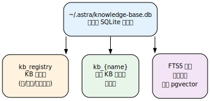
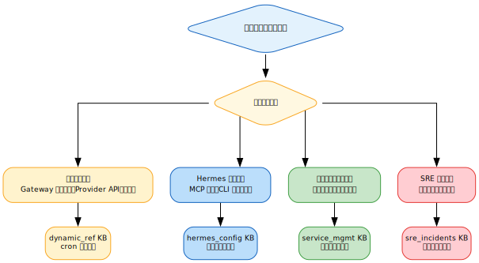

# 第十六章：知识库与信息分级储存
\label{ch:16}

!!! info "本章对应 Astra 生态组件"
    - [`astra-knowledge-base-mcp`](https://github.com/alrcatraz/astra-knowledge-base-mcp) — MCP 知识库服务
    - [`astra-aiagent-infra`](https://github.com/alrcatraz/astra-aiagent-infra) — 生态门户

## 16.1 为什么需要知识库？

随着 Hermes Agent 积累的技能、配置、偏好越来越多，如何高效地组织和检索信息成为一个关键问题。Hermes 提供了多层记忆系统，但 **知识库（Knowledge Base）** 是专门为长期、结构化信息设计的存储方案。

### 三种独立存储机制

Hermes 提供三种**独立互补**的存储机制——各司其职，而非层级关系：

| 存储机制 | 存储内容 | 示例 | 访问方式 |
|:--------|:--------|:----|:--------|
| **Memory（记忆）** | 用户偏好、简短事实 | 语言偏好、常用路径 | 自动注入上下文 |
| **Skill（技能）** | 流程性知识、工作流 | 操作步骤、命令模板 | 按场景触发加载 |
| **Knowledge Base MCP（知识库）** | 结构化长期信息 | 设备清单、事故记录、参考文档 | MCP 查询工具 |

## 16.2 MCP 知识库服务器

Astra 生态的 `astra-knowledge-base-mcp` 是一个轻量级知识库服务，使用 SQLite 作为后端存储，通过 MCP 协议向 Hermes 暴露工具接口。

### 安装

```bash
# 克隆仓库
git clone https://github.com/alcatraz/astra-knowledge-base-mcp.git
cd astra-knowledge-base-mcp

# 安装依赖
uv sync
```

### 配置到 Hermes

在 `config.yaml` 的 `mcp_servers` 段添加：

```yaml
mcp_servers:
  astra-knowledge-base:
    command: /path/to/astra-knowledge-base-mcp/run.sh
    enabled: true
```

### 常用操作

```bash
# 创建知识库
# Agent 通过 MCP 工具自动完成
```

## 16.3 实战：信息分级存储策略

通过合理划分知识库，可以实现信息的分级管理与快速检索。

!!! tip "设计原则"
    将**不变信息**（设备规格、凭证索引）与**变化信息**（事故记录、运行日志）分开存储，便于定期清理和更新。

---

## 16.4 建库策略与实战

Astra 生态中的 `astra-knowledge-base-mcp` 已部署并在线，维护以下知识库：

| 知识库 | 用途 | 更新方式 |
|:-------|:-----|:---------|
| `dynamic_ref` | 会变的参考数据（Gateway 消息长度、Provider API、工具坑） | cron 定期刷新 |
| `hermes_config` | Hermes 附加配置（外挂服务/MCP/CLI 工具/端口/路径） | 部署时手动更新 |
| `service_mgmt` | 管理方案（健康检查/维护日志/事件记录） | 运行时自动写入 |
| `sre_incidents` | SRE 事故记录（根因分析、诊断过程、修复经验） | 每次事故后记录 |

### 16.4.1 SQLite + FTS5 后端

该 MCP 知识库服务使用 **SQLite** 作为后端存储，通过 FTS5 提供全文搜索能力。对于单 Agent 知识库工作负载，SQLite 完全够用，且无外部数据库依赖。

数据库架构：



MCP 工具接口保持完全一致：

| 工具 | 功能 |
|:-----|:-----|
| `kb_list()` | 列出所有 KB，含启用/禁用状态 |
| `kb_create(name, description)` | 创建新知识库 |
| `kb_delete(name)` | 删除知识库 |
| `kb_enable(name)` / `kb_disable(name)` | 按需开关特定 KB |
| `kb_add(kb, content, title, source, tags)` | 添加知识条目（自动分块） |
| `kb_search(query, kb_names, limit)` | 跨 KB 搜索 |

### 16.4.2 信息分级存储决策树

面对一条新信息时，如何决定它该存到哪里？以下是 Astra 实战中形成的决策树：



### 16.4.3 标签与搜索实战

为知识条目打标签是小投入高回报的做法。以下来自 `sre_incidents` 知识库的示例：

```python
# 添加事故记录（带标签）
kb_add(
    kb="sre_incidents",
    title="E2EE Stale OTK 修复",
    content="根因：Panic 重启导致 OTK 计数归零...",
    tags=["e2ee", "otk", "gateway", "repair"]
)

# 按标签分类搜索
kb_search("OTK 同步失败", kb_names=["sre_incidents"])
```

标签建议：

- **领域标签**：`e2ee`, `mcp`, `credential`, `gateway`
- **操作标签**：`repair`, `diagnosis`, `config`, `deploy`
- **严重级别标签**：`p1`, `p2`, `p3`

### 16.4.4 MCP 知识库配置到 Hermes

在 `~/.hermes/config.yaml` 的 `mcp_servers` 段配置 MCP 知识库服务：

```yaml
mcp_servers:
  astra-knowledge-base:
    command: uv run --directory /path/to/astra-knowledge-base-mcp server.py
    env:
      ASTRA_KB_PATH: ~/.astra/knowledge-base.db
    enabled: true
```

配置后，Hermes Agent 在会话中即可通过 `kb_search()` 查询知识库，无需每次手动打开文件或翻阅 skill 目录。

!!! tip "搜索优先原则"
    在诊断新故障之前，**总是**先 `kb_search("sre_incidents", <症状>)`。很多问题之前已经被解决过。知识库是故障排查的“第一枪”。
