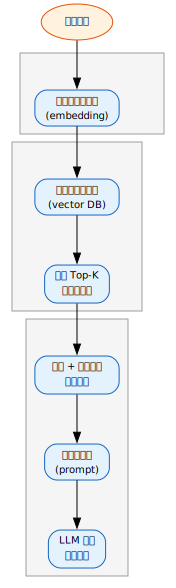
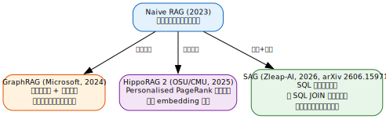
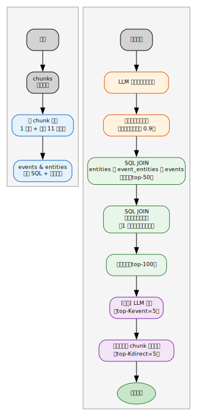
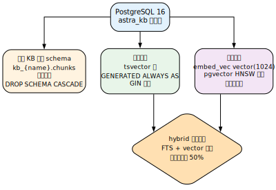

\\newpage

# 第17章：知识库与信息分级储存 {#ch:17}

!!! info "本章对应 Astra 生态组件"
    - [`astra-knowledge-base-mcp`](https://github.com/alrcatraz/astra-knowledge-base-mcp) — MCP 知识库服务
    - [`astra-aiagent-infra`](https://github.com/alrcatraz/astra-aiagent-infra) — 生态门户

## 17.1 什么是知识库？

**知识库（Knowledge Base, KB）** 是一种用于持久化存储结构化信息的系统，区别于短期记忆（Memory）和流程知识（Skill），知识库专门管理**可查询的长期信息资产**——设备清单、事故记录、参考文档、配置数据等。

在 Agent 系统中，知识库承担着以下核心职责：

- **持久化存储**：信息不会因会话结束而丢失
- **多维度检索**：同时支持关键词精确匹配和语义模糊搜索
- **结构化组织**：通过标签、分类、模式（schema）实现信息分级管理
- **跨会话共享**：不同会话间的 Agent 实例可以共享同一知识库

知识库与传统数据库的区别在于：它不仅是存数据的容器，更是**面向 Agent 查询优化的检索系统**——支持混合搜索、向量相似度匹配、以及最新的结构化增强检索（SAG）。

## 17.2 什么是 RAG？

检索增强生成（**Retrieval-Augmented Generation, RAG**）是一种让大语言模型在生成回答时、先从外部知识库检索相关信息的架构模式。

### 17.2.1 RAG 的基本流程

{ width=35% }

**图 17.2-1**: Naive RAG（朴素 RAG）的基本流程

经典的 RAG 流程分为三步：

1. **索引（Indexing）**：将文档切分为小块（chunks），每块通过嵌入模型（embedding model）转换为向量，存入向量数据库
2. **检索（Retrieval）**：用户查询时，将查询文本向量化，在向量库中按余弦相似度检索最相关的 Top-K 文档块
3. **生成（Generation）**：将查询文本和检索到的文档块组合为提示词（prompt），交给 LLM 生成回答

### 17.2.2 Naive RAG 的特点

| 维度 | 评价 |
|:-----|:-----|
| 实现简单度 | ✅ 极简——只需 embedding + vector DB |
| 跨文档推理 | ❌ 不支持——每个 chunk 独立检索 |
| 增量更新 | ✅ 自然——新 chunk 直接插入无需重建 |
| 全局归纳 | ❌ 不支持——缺乏整体视角 |
| 成本 | ✅ 最低——不需要额外的 LLM 调用 |
| 可追溯性 | ⚠️ 中等——结果来自 Top-K 相似度，但路径不透明 |

**适合场景**：简单的问答、独立的文档块检索、不需要跨文档推理的任务。

## 17.3 RAG 技术的演进与比较

RAG 并非终点。随着 Agent 对检索质量要求的提升，业界发展出了多种增强架构。

### 17.3.1 技术演进路线

{ width=95% }

**图 17.3-1**: RAG 技术演进路线比较

### 17.3.2 架构对比

| 维度 | Naive RAG | GraphRAG | SAG |
|:-----|:----------|:---------|:----|
| **核心思路** | chunk → vector → top-K | 实体关系图 → 社区摘要 | chunk → event + entity → SQL JOIN |
| **多跳推理** | ❌ 无 | ✅ 较好 | ✅ **SOTA** (Avg Recall@2 79.3%) |
| **全局归纳** | ❌ 无 | ✅ **最佳** | ❌ 无社区机制 |
| **增量更新** | ✅ 自然 | ❌ **极差**（社区重算） | ✅ 自然 |
| **离线成本** | ✅ 最低 | ❌ 极高（LLM 大量调用） | ⚠️ 中等（每 chunk 一次提取） |
| **嵌入鲁棒性** | ✅ 标准 | ✅ 标准 | ✅ **高**（核心增益来自 SQL JOIN） |
| **基础设施** | 任意向量库 | 需要图数据库 | ✅ 任意 SQL DB + 向量索引 |
| **全链路可追溯** | ⚠️ 部分 | ⚠️ 部分 | ✅ 每步可审计 |

### 17.3.3 SAG 详解

SAG（SQL-Retrieval Augmented Generation）由 Zleap-AI 提出（arXiv 2606.15971，MIT 协议），是 RAG 领域的**第三代架构**——它不是 RAG 的增强或 GraphRAG 的替代，而是一种全新的设计范式。

**核心创新**：将文档块转化为 **事件（event）** 和 **实体（entity）** 两种结构化数据，在查询时通过 SQL JOIN 动态构建局部超边（hyperedge），实现跨文档的多跳推理。

{ width=70% }

**图 17.3-2**: SAG 的索引与查询管道，展示从文档分块到去重输出的完整流程

**11 种实体类型**：time（时间）、location（地点）、person（人物）、organization（组织）、group（群体）、topic（主题）、work（作品）、product（产品）、action（行为）、metric（指标）、label（标签）。

**为什么选择 SQL 而不是图？**

- SQL 是现成的——已有 PostgreSQL + pgvector 即可直接支持
- SQL JOIN 天然支持动态关系——不需要预计算社区结构
- 每 chunk 独立提取事件和实体，**增量更新时不需要重算任何全局结构**
- 全链路可审计——每个命中都可以追溯到 `query → entity → seed → expand → output`


## 17.4 为什么需要知识库？

在理解了 RAG、GraphRAG 和 SAG 这些检索技术之后，回到一个更基础的问题：**Agent 为什么需要知识库？**

随着 Hermes Agent 积累的技能、配置、偏好越来越多，如何高效地组织和检索信息成为一个关键问题。Hermes 提供了多层记忆系统，但 **知识库（Knowledge Base）** 是专门为长期、结构化信息设计的存储方案。

### 17.4.1 三种独立存储机制

Hermes 提供三种**独立互补**的存储机制——各司其职，而非层级关系：

| 存储机制 | 存储内容 | 示例 | 访问方式 |
|:--------|:--------|:----|:--------|
| **Memory（记忆）** | 用户偏好、简短事实 | 语言偏好、常用路径 | 自动注入上下文 |
| **Skill（技能）** | 流程性知识、工作流 | 操作步骤、命令模板 | 按场景触发加载 |
| **Knowledge Base MCP（知识库）** | 结构化长期信息 | 设备清单、事故记录、参考文档 | MCP 查询工具 |

### 17.4.2 为什么不是只用 Memory 或 Skill？

- **Memory** 适合简短事实（"用户偏好中文"），但不适合存储大量结构化记录（"2025-03-20 Gateway 重启恢复"）
- **Skill** 适合操作流程（"如何部署 Nginx"），但不适合存储不断增长的数据资产
- **知识库** 的设计目标就是解决以上两者的盲区——**大量、结构化、可查询**的长期信息

### 17.4.3 搜索优先原则

知识库的核心价值在于**可检索**。与 Memory（自动注入）和 Skill（按场景加载）不同，知识库需要 Agent **主动查询**。这要求建立明确的搜索习惯：

**搜索优先原则**：在诊断新故障或处理重复性任务之前，总是先 `kb_search(...)`。很多问题之前已经被解决过。知识库是排查的"第一枪"。

**搜索优先的三层含义：**

1. **知识库优先于猜测** — 遇到陌生问题先搜知识库，不凭空假设
2. **知识库优先于从头排查** — 已知问题或相似场景的记录已在库中
3. **搜索即知识积累** — 每次成功的排查都应该留记录进知识库

例如 SRE 场景下的典型流程：

```
发现服务异常 → kb_search("sre_incidents", "服务 502")
  → 返回历史记录：上次同样是 PM2 进程挂掉
  → pm2 restart → 恢复 → kb_add 记录本次事件
```

如果没有搜索结果，排查完毕后 `kb_add` 记录根因+解决方案，形成正向循环。

## 17.5 Astra 知识库 MCP 服务

Astra 生态的 `astra-knowledge-base-mcp` 知识库服务使用 **PostgreSQL 16 + pgvector 0.8** 作为后端存储，通过 MCP 协议向 Hermes 暴露工具接口。它支持从 Naive RAG 到 SAG 的全系列检索模式。

### 17.5.1 设计原则

- **PostgreSQL 原生**：不使用 SQLite 或其他嵌入式数据库，一切存储（包括 embedding cache）都跑在 PostgreSQL 上
- **提供者无关的嵌入层**：所有嵌入服务都通过 OpenAI 兼容的 `/v1/embeddings` API 接入，通过环境变量参数化
- **搜索模式可插拔**：FTS、向量、SAG 三种模式在同一套表结构上共存，互不影响
- **每 KB 独立隔离**：每个知识库对应独立的 PostgreSQL schema，删除即 `DROP SCHEMA ... CASCADE`
- **自动嵌入缓存**：SHA256(content) → vector，PostgreSQL 嵌入缓存表，keyed by model name

### 17.5.2 后端架构

与原来的 SQLite + FTS5 方案不同，新版后端采用 PostgreSQL 的原生全文搜索（`tsvector`）配合 pgvector 向量索引，实现了五种搜索模式：

| 搜索模式 | 实现 | 适用场景 |
|:--------|:-----|:---------|
| **fts** | PostgreSQL `tsvector` + GIN 索引 | 精确关键词匹配，适合故障代码、IP 地址、命令名 |
| **vector** | pgvector `hnsw` 索引 + 余弦相似度 | 语义搜索，适合自然语言描述的症状、概念 |
| **hybrid**（默认） | FTS + vector 融合排序 | 综合场景，兼具精确匹配和语义理解 |
| **sag_fast** | event 向量直接检索 → 映射到 chunk | 快速 SAG 检索，无需 LLM 参与查询 |
| **sag_precise** | LLM 提取查询实体 → entity 向量 → SQL JOIN 种子 → 超边扩展 → 粗排 → 合并 | 高精度多跳推理（参考 arXiv 2606.15971） |

**数据隔离：** 每个知识库对应一个独立的 PostgreSQL schema（`kb_<name>`），各 schema 下的 `chunks` 表结构相同但物理隔离，删除知识库只需 `DROP SCHEMA … CASCADE`，干净彻底。

### 17.5.3 PostgreSQL chunks 表结构

每 KB 的 `chunks` 表同时承载全文索引和向量索引：

```sql
CREATE TABLE kb_<name>.chunks (
    id         SERIAL PRIMARY KEY,
    title      TEXT NOT NULL DEFAULT '',
    content    TEXT NOT NULL,
    source     TEXT,
    tags       TEXT[] DEFAULT '{}',
    media_url  TEXT,
    media_type TEXT,
    embed_vec  vector(1024),                              -- ← pgvector 列
    created_at TIMESTAMPTZ NOT NULL DEFAULT now(),
    search_vec TSVECTOR GENERATED ALWAYS AS (             -- ← 自动全文索引
        to_tsvector('simple', coalesce(title,'') || ' ' || content)
    ) STORED
);

CREATE INDEX idx_<name>_fts ON kb_<name>.chunks USING gin(search_vec);
CREATE INDEX idx_<name>_embed ON kb_<name>.chunks USING hnsw (embed_vec vector_cosine_ops);
```

{ width=70% }

### 17.5.4 SAG 扩展表结构

当启用 SAG 模式时，每个知识库额外创建三张表：

```sql
CREATE TABLE events (
    id         SERIAL PRIMARY KEY,
    chunk_id   INTEGER NOT NULL REFERENCES chunks(id) ON DELETE CASCADE,
    event_text TEXT NOT NULL,
    embed_vec  vector(1024)
);

CREATE TABLE entities (
    id          SERIAL PRIMARY KEY,
    name        TEXT NOT NULL,
    entity_type TEXT NOT NULL,       -- 11 种类型之一
    embed_vec   vector(1024),
    UNIQUE(name)
);

CREATE TABLE event_entities (
    event_id  INTEGER REFERENCES events(id) ON DELETE CASCADE,
    entity_id INTEGER REFERENCES entities(id) ON DELETE CASCADE,
    PRIMARY KEY (event_id, entity_id)
);

CREATE INDEX ON events USING hnsw (embed_vec vector_cosine_ops);
CREATE INDEX ON entities USING hnsw (embed_vec vector_cosine_ops);
```

- `events`：每 chunk 提取一个事件（语义完整的句子）
- `entities`：实体（名称+类型），全库轻量去重
- `event_entities`：事件-实体关联表，是 SQL JOIN 多跳推理的核心

### 17.5.5 信息分级存储决策树

面对一条新信息时，如何决定它该存到哪里？以下是 Astra 实战中形成的决策树：

{ width=90% }

### 17.5.6 标签与搜索实战

为知识条目打标签是小投入高回报的做法。以下来自 `sre_incidents` 知识库的示例：

```python
# 添加事故记录（带标签）
kb_add(
    kb="sre_incidents",
    title="E2EE Stale OTK 修复",
    content="根因：Panic 重启导致 OTK 计数归零...",
    tags=["e2ee", "otk", "gateway", "repair"]
)

# 按标签分类搜索
kb_search("OTK 同步失败", kb_names=["sre_incidents"])
```

标签建议：

- **领域标签**：`mcp`, `credential`, `gateway`
- **操作标签**：`repair`, `diagnosis`, `config`, `deploy`
- **严重级别标签**：`p1`, `p2`, `p3`

### 17.5.7 MCP 工具接口

| 工具 | 功能 |
|:-----|:-----|
| `kb_list()` | 列出所有 KB，含启用/禁用状态 |
| `kb_create(name, description)` | 创建新知识库（自动建 schema + 表） |
| `kb_delete(name)` | 删除知识库（`DROP SCHEMA … CASCADE`） |
| `kb_enable(name)` / `kb_disable(name)` | 按需开关特定 KB |
| `kb_add(kb, content, title, source, tags)` | 添加知识条目（自动分块 + 嵌入向量） |
| `kb_search(query, kb_names, limit, search_mode)` | 跨 KB 搜索，`search_mode` 支持 `hybrid` / `fts` / `vector` / `sag_fast` / `sag_precise` |
| `kb_list_chunks(kb, limit, offset)` | 分页浏览知识库内容 |
| `kb_update(kb, chunk_id, ...)` | 更新条目（支持 `replace` / `append` 模式） |
| `kb_delete_chunk(kb, chunk_id)` | 删除单条记录 |
| `kb_extract(kb)` | 从 KB 中提取事件和实体（SAG 索引，参考 arXiv 2606.15971） |

### 17.5.8 分块策略

系统支持三种分块策略，可在调用时按需选择：

| 策略 | 适用场景 | 工作方式 |
|:-----|:---------|:---------|
| `recursive`（默认） | 通用文本 | 段落 → 句子 → 固定大小 + 重叠 |
| `heading-anchor` | 带标题的 Markdown 文档 | 按 `#/##/###` 分块，保留层级标题 |
| `semantic` | 长无结构文本 | 嵌入余弦相似度检测主题边界 |

!!! tip "分块策略选择"
    Markdown 文档（事故报告、操作指南）→ 使用 `heading-anchor`，生成的块带有层级标题（如"根因分析 > 网络 > DNS"），搜索结果一目了然。
    无结构文章 → 使用 `semantic`，依赖嵌入 API 检测主题边界。
    通用文本 → 使用 `recursive`，开销最低，无外部依赖。

## 17.6 实践：安装与使用

### 17.6.1 安装

```bash
# 克隆仓库
git clone https://github.com/alrcatraz/astra-knowledge-base-mcp.git
cd astra-knowledge-base-mcp

# 安装依赖
uv sync
```

### 17.6.2 前提条件

```bash
# PostgreSQL 16 + pgvector 扩展
sudo zypper install postgresql16-server postgresql16-contrib
# 或通过源码安装 pgvector 0.8.2+

# 创建数据库并启用扩展
sudo -u postgres createdb astra_kb
sudo -u postgres psql -d astra_kb -c "CREATE EXTENSION IF NOT EXISTS vector;"
```

### 17.6.3 配置到 Hermes

在 `config.yaml` 的 `mcp_servers` 段添加：

```yaml
mcp_servers:
  astra-knowledge-base:
    command: /path/to/astra-knowledge-base-mcp/run.sh
    enabled: true
    env:
      ASTRA_KB_BACKEND: postgres
```

环境变量说明：

| 变量 | 默认值 | 说明 |
|:-----|:-------|:-----|
| `ASTRA_KB_BACKEND` | `postgres` | 后端类型（仅 `postgres`） |
| `ASTRA_KB_PG_DSN` | `dbname=astra_kb user=postgres host=/run/postgresql` | PostgreSQL 连接串 |
| `ASTRA_EMBED_BASE_URL` | —（必需） | 嵌入 API 端点（OpenAI 兼容，如 `https://api.siliconflow.cn/v1`） |
| `ASTRA_EMBED_API_KEY` | - | 嵌入 API 密钥（远程 API 必需；本地模型如 llama.cpp 可留空） |
| `ASTRA_EMBED_MODEL` | `Qwen/Qwen3-VL-Embedding-8B` | 嵌入模型名称（VL 版支持图文混合嵌入） |
| `ASTRA_EMBED_DIM` | `1024` | 嵌入向量维度 |
| `ASTRA_LLM_BASE_URL` | —（SAG 提取必需） | LLM 端点（OpenAI 兼容，如 `https://api.siliconflow.cn/v1`） |
| `ASTRA_LLM_API_KEY` | - | SAG 提取 API 密钥 |
| `ASTRA_LLM_MODEL` | `THUDM/GLM-Z1-9B-0414` | SAG 提取模型 |

!!! tip "环境变量按需配置"
    大多数情况下只需 `ASTRA_KB_BACKEND: postgres`。嵌入服务**无默认提供商**——需至少设置 `ASTRA_EMBED_BASE_URL`。远程 API 还需设置 `ASTRA_EMBED_API_KEY`；本地嵌入模型（如 llama.cpp）无需 API Key，可留空。
    
    SAG 事件抽取需要额外设置 `ASTRA_LLM_BASE_URL` 和 `ASTRA_LLM_MODEL`（`ASTRA_LLM_API_KEY` 按需）。若不设置，`kb_extract` 工具会跳过 LLM 提取步骤。

### 17.6.4 信息分级实战

通过合理划分知识库，可以实现信息的分级管理与快速检索。

Astra 生态中维护的知识库示例：

| 知识库 | 用途 | 更新方式 |
|:-------|:-----|:---------|
| `dynamic_ref` | 会变的参考数据（Gateway 消息长度、Provider API、工具坑） | cron 定期刷新 |
| `hermes_config` | Hermes 附加配置（外挂服务/MCP/CLI 工具/端口/路径） | 部署时手动更新 |
| `service_mgmt` | 管理方案（健康检查/维护日志/事件记录） | 运行时自动写入 |
| `sre_incidents` | SRE 事故记录（根因分析、诊断过程、修复经验） | 每次事故后记录 |

!!! tip "设计原则"
    将**不变信息**（设备规格、凭证索引）与**变化信息**（事故记录、运行日志）分开存储，便于定期清理和更新。

### 17.6.5 验证

配置后，Hermes Agent 在会话中即可通过 `kb_search()` 查询知识库，无需每次手动打开文件或翻阅 skill 目录。默认使用 **hybrid 混合搜索**，同时匹配关键词和语义相似度。如需精确匹配，可指定 `search_mode: "fts"`；如查询自然语言描述，可指定 `search_mode: "vector"`。

```bash
# 检查知识库列表
kb_list()

# 创建新知识库
kb_create(name="my_kb", description="我的知识库")

# 添加知识条目
kb_add(kb="my_kb", title="示例条目", content="这是一条测试内容", tags=["test"])

# 搜索（默认 hybrid 模式）
kb_search("测试内容", kb_names=["my_kb"])

# 搜索（SAG 精确模式）
kb_search("跨文档关系", kb_names=["my_kb"], search_mode="sag_precise")
```

---
