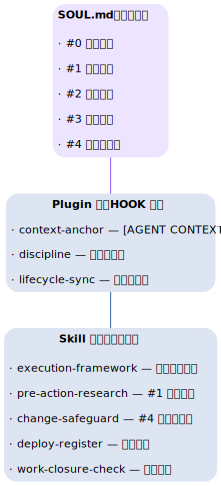
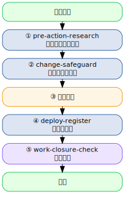

# 第十七章：全流程工作原则的 Skill 辅助监督 {#ch:17}

!!! info "本章对应 Astra 生态组件"
    - [`astra-skill-execution-framework`](https://github.com/alcatraz/astra-skill-execution-framework) — 执行框架
    - [`astra-skill-change-safeguard`](https://github.com/alcatraz/astra-skill-change-safeguard) — 变更安全
    - [`astra-skill-deploy-register`](https://github.com/alcatraz/astra-skill-deploy-register) — 部署登记
    - [`astra-skill-pre-action-research`](https://github.com/alcatraz/astra-skill-pre-action-research) — 预研
    - [`astra-skill-work-closure-check`](https://github.com/alcatraz/astra-skill-work-closure-check) — 收尾检查

## 17.1 从原则到自动化

[第六章](../volume-1/06-principles.md) 介绍了 Hermes Agent 的工作原则——“先保全再改”“研究先行”等。
这些原则如果只靠记忆，很难每次都严格执行。

**Skill 系统** 正是将原则转化为自动执行流程的关键：



## 17.2 Astra 工作流 Skill 套件

Astra 生态包含一套完整的、互相衔接的 Skill，覆盖从接到任务到收尾的全流程：

### 执行框架（Execution Framework）

工作流的“指挥中心”，定义了任务的整体流程：



### 各 Skill 职责

| Skill | 触发时机 | 核心职责 |
|:------|:--------|:--------|
| **pre-action-research** | 任务开始时 | 搜索文档、验证方案可行性 |
| **change-safeguard** | 任何修改前 | 备份文件/配置、记录环境基线 |
| **deploy-register** | 部署新服务后 | 登记到服务清单、健康检查 |
| **work-closure-check** | 任务结束时 | 验证结果、清理临时文件、更新 skill |

## 17.3 安装与配置

```bash
# 克隆到 skills 目录
git clone https://github.com/alcatraz/astra-skill-pre-action-research.git \
  ~/.hermes/skills/pre-action-research
```

Hermes 会自动加载 skill，无需额外配置。

---

## 17.4 Hermes 自动加载机制

Hermes 的 skill 系统采用**触发式自动加载**——Agent 不需要显式调用某个 skill，而是由 skill 自身的 `trigger` 描述（汉英双语关键词）匹配当前任务，匹配成功后自动注入上下文。

### 17.4.1 SKILL.md 格式

每个 skill 的核心是一个 `SKILL.md` 文件，位于 `~/.hermes/skills/<category>/<skill-name>/` 目录下。文件头部使用 YAML frontmatter 声明元数据：

```yaml
---
name: change-safeguard
description: "Mandatory pre-change safeguarding checks..."
category: devops
version: 1.0.0
tags: [safety, backup, baseline]
---
```

### 17.4.2 执行框架：统一入口

Astra 生态的五步 Skill 工作流通过 **执行框架（execution-framework）** 统一调度。这是一个“指挥中心” skill，在接到任何任务时首先加载，然后根据任务类型路由到对应的子 skill。

执行框架维护一个 `routing.yaml` 路由表：

| 任务类型 | 路由目标 | 对应原则 |
|:---------|:---------|:---------|
| 研究/方案 | pre-action-research | §1.1 研究先行，方案求精 |
| 修改系统 | change-safeguard | §2.1 先保全再改 |
| 部署服务 | deploy-register | §4.2 部署即登记 |
| 收尾闭环 | work-closure-check | §4.3 确认成功 |

执行框架还具有**自我进化**能力：每次加载时运行 `scripts/sync-routing.py --diff` 检查路由表是否最新，发现新 skill 未注册时及时更新路由。

## 17.5 各 Skill 详细配置

### 17.5.1 pre-action-research — 研究先行

此 skill 确保在动手之前完成必要的信息收集：

**检查清单：**

- [ ] 是否涉及需要查询的信息类型？（凭证/偏好/设备/服务/项目）
- [ ] 是否有相关文档、官方资料或教程可参考？→ 先查阅再提方案
- [ ] 方案是否已形成并获得用户明确批准？→ 不能跳过批准直接动手

**关键陷阱：**

- 不要跳过查索引直接凭记忆操作——记忆可能过时
- 不要把“诊断结论”和"治疗方案”合并成一步——即使是“明显"的修复也要先提方案
- 需要密码/sudo → 先查 GPG 凭据库，不要问用户要

### 17.5.2 change-safeguard — 变更安全

此 skill 在**任何系统修改前**强制执行保障措施：

**动手前检查清单：**

- [ ] 备份做了吗？（三级：服务器→跨机器 / 项目→git commit / 文件→.bak）
- [ ] 环境基线记录了吗？（systemd 服务列表、监听端口、Docker 容器、挂载点、crontab、网络配置）

**动手后检查清单：**

1. **根因定位**：我是治标还是治本？
2. **同类扫描**：系统其他地方有没有相同模式需要同步调整？
3. **副作用审查**：是否无意中影响了别处？
4. **新暴露问题**：有没有揭露隐藏问题？
5. **残留清理**：旧的配置、注释、回退路径是否清理？

**关键陷阱：**

- 不要用 `sed -i` 编辑 Hermes config.yaml（深层嵌套结构极易损坏）
- 迁移共享基础设施前，先审计所有依赖方
- 准备推送公开仓库前，执行脱敏审计

### 17.5.3 deploy-register — 部署登记

新服务部署后立即登记，防止"管理黑洞"（未记录的服务发生故障时你不知道它的存在）：

**检查清单：**

- [ ] 服务信息已登记到服务清单？（名称、部署位置、端口、用途、健康检查方式）
- [ ] 已接入自动化健康检查？
- [ ] astra-aiagent-infra 生态登记？（registry.yaml + README.md）
- [ ] 依赖关系标注？
- [ ] 旧版本/旧进程/旧配置清理？
- [ ] 临时文件清理？

### 17.5.4 work-closure-check — 收尾闭环

任务结束时，**必须先执行此 skill 的系统化检查，再通知用户确认成功**。包含七个检查阶段：

1. **凭证泄露扫描** — 检查 memory、terminal output、skill 内容、临时文件中是否有明文密码
2. **技能更新检查** — 本次是否值得创建/更新 skill？遵循“Skills first, memory second”原则
3. **决策记录检查** — 是否做了“为什么选 A 不选 B”的决策需要记录？
4. **服务/设备登记检查** — 是否部署了新服务、新 MCP、新设备需要登记？
5. **信息存储检查** — 盘点可用持久化工具，确认应记已记、已记不错
6. **环境基线对比** — 如果操作前记录了基线，操作后逐项对比
7. **提交整理** — 如果是 astra 生态项目，按 Conventional Commits 规划提交

**标准收尾流程：**
```
1. ✅ 通知用户 — "任务做完了，请确认是否成功"
2. ⏳ 等待确认 — 不允许跳过确认直接清理
3. 🧹 用户确认后 — 清理临时文件/脚本
4. 📝 完整汇总 — 做了什么、结果如何、遗留问题
5. 📚 收尾再问 — "还有什么需要帮忙的吗？"
```

## 17.6 安装与配置实战

```bash
# 所有 skill 克隆到 ~/.hermes/skills/ 目录
# Hermes 会自动扫描子目录并加载 SKILL.md

# 示例：克隆执行框架
git clone https://github.com/alrcatraz/astra-skill-execution-framework.git \
  ~/.hermes/skills/devops/execution-framework

# 示例：克隆变更安全 skill
git clone https://github.com/alrcatraz/astra-skill-change-safeguard.git \
  ~/.hermes/skills/devops/change-safeguard

# 验证：查看已加载的 skill 列表
hermes skill list
```

## 17.7 自定义 Skill

创建自定义 skill 的最简步骤：

```bash
mkdir -p ~/.hermes/skills/my-category/my-skill

cat > ~/.hermes/skills/my-category/my-skill/SKILL.md << 'EOF'
---
name: my-skill
description: "Brief description of what this skill does"
category: my-category
---

# My Skill

## Trigger Conditions

This skill is automatically loaded when the task involves:
- Doing X
- Configuring Y

Also triggered by: 做X、配置Y

## Checklist

- [ ] Step 1: Do this
- [ ] Step 2: Verify that

## Pitfalls

1. Don't forget to check Z before proceeding.
EOF
```

!!! tip "class-level 命名原则"
    新 skill 必须是 class-level 名称（`fix-common-pattern` ✅），不能是具体 session 产物（`fix-something-today` ❌）。Session 特有的细节存入 `references/` 子目录。
