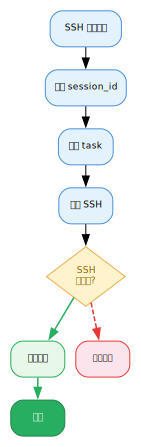

# 第18章：上下文锚定 — 帮助 Hermes Agent 进行回忆和减少错乱 {#ch:18}

!!! info "本章对应 Astra 生态组件"
    - `context-anchor`（位于 `astra-aiagent-infra/work-principles/plugin/context-anchor/`）
    - `astra-web-extract-markitdown`

## 18.1 问题：长会话中的认知错乱

Hermes Agent 的每一次交互都是无状态的——LLM 本身不记得上一轮对话的内容，全靠 Hermes 框架在每轮调用前将完整的对话历史和系统提示词重新注入。这带来两个问题：

**问题一：会话漂移（Session Drift）。** 随着对话增长，上下文窗口逐渐被填满。当窗口满时，最早的消息被截断，Agent 丧失了"一开始我想做什么"的感知。在长达数百轮的生产会话中，Agent 容易忘记最初的任务目标，开始跑偏。同样的，它还可能搞混自己在哪台设备上工作（比如把自己的宿主机当成需要远程调试的另一台机器，或者反过来；或者记错指定设备的hostname、访问方式、登录凭据等）。

**问题二：会话断裂（Session Reset）。** Hermes 每日自动重置会话（`/new`），或将长期会话拆分为多个子会话。重置后，对话历史从零开始——Agent 完全不知道上一个会话做了什么、当前登录到哪台机器、上一个线程有哪些会话 ID。

这两个问题合在一起，构成一个经典的 **Agent 认知错乱** 场景：一个工作日可能包含 5-10 个独立会话，Agent 每次醒来都是一个"全新"的实例，而你期望它记住：

- 当前正在操作的主机（可能已通过 SSH 跳转到另一台机器）
- 正在进行的任务（部署、调试、巡检？）
- 之前的会话串（哪些会话属于同一个工作线程）

**这就是 Context Anchor 要解决的问题。**

## 18.2 Context Anchor 的工作原理

Context Anchor 是一个 Hermes Plugin，通过 **生命周期钩子** 在每轮 LLM 调用前自动注入上下文标头。它的核心策略是：

1. **每轮调用都注入 `[AGENT CONTEXT]` 标头** — 告诉 Agent 它现在在哪儿、在干什么
2. **跨会话持久化状态** — 状态文件存放在 `~/.hermes/persistent/` 目录下，Hermes 内核在会话重置时会自动恢复该目录，状态不会丢失
3. **自动推断任务上下文** — 从终端命令中提取"动词:主语"，无需 Agent 手动声明
4. **追踪会话线程** — 记录最近 20 个会话 ID，形成线程历史

### 注入后的效果

Agent 看到的系统提示词头部会被插入这样的标头：

```
[AGENT CONTEXT] host=alrcatraz | task=ssh:100.64.0.1
[THREAD HISTORY] 5 session(s) in this thread. Last: sess_abc123
```

这行信息告诉 Agent：**你在 `alrcatraz` 上，正在通过 SSH 操作 `100.64.0.1`，这是今天第 5 个会话，上一个会话 ID 是 `sess_abc123`。**

即使对话历史已经被截断或重置，Agent 依然知道自己身处哪个上下文。

## 18.3 架构详解

### 18.3.1 双钩子架构

Context Anchor 注册两个生命周期钩子：

| 钩子 | 触发时机 | 职责 |
|:-----|:---------|:-----|
| `pre_llm_call` | 每次 LLM 调用前 | 读取 `context-anchor.json`，注入 `[AGENT CONTEXT]` 标头 |
| `post_tool_call` | 每次工具调用后 | 记录会话 ID、检测 SSH 跳转、推断任务 |



### 18.3.2 状态文件：`context-anchor.json`

Context Anchor 使用独立的 `context-anchor.json`，与 discipline 插件（`state.json`）互不干扰：

```json
{
  "current_host": "alrcatraz",
  "current_task": "ssh:100.64.0.1",
  "thread_session_ids": [
    "sess_a1b2c3d4",
    "sess_e5f6g7h8"
  ],
  "updated_at": "2026-07-05T14:30:00Z"
}
```

四个字段：

- **`current_host`**：自动检测（`hostname -s`），SSH 跳转时自动更新
- **`current_task`**：从终端命令中推断，如 `ssh:100.64.0.1`、`emerge:world`、`grep:gateway.log`
- **`thread_session_ids`**：最近 20 个会话 ID（去重、FIFO 队列）
- **`updated_at`**：ISO 8601 时间戳，用于任务切换防抖

### 18.3.3 主机自动检测

`post_tool_call` 解析终端命令，自动识别 SSH 跳转：

```python
# SSH 进入 → 更新 current_host
ssh root@192.168.0.11    → host = "192.168.0.11"
ssh -p 2222 user@server  → host = "server"

# 退出 → 重置为本地主机名
exit / logout / quit     → host = "alrcatraz" (hostname -s)
```

### 18.3.4 任务自动推断

不依赖 Agent 手动声明任务——Context Anchor 从终端命令中**生成式地**提取 `动词:主语`：

| 命令 | 推断结果 |
|:-----|:---------|
| `ssh -p 2222 root@100.64.0.1` | `ssh:100.64.0.1` |
| `emerge -uDN @world` | `emerge:world` |
| `grep dm_topic gateway.log` | `grep:gateway.log` |
| `cat /etc/sysctl.conf` | `cat:sysctl.conf` |
| `curl https://api.example.com/v1` | `curl:api.example.com` |
| `docker ps --all` | `docker:ps` |
| `journalctl -u sshd` | `journalctl:sshd` |
| `dmesg \| grep error` | `dmesg:error` |
| `python3 scripts/deploy.py` | `python3:deploy.py` |

推断策略：

1. 剥离前置修饰（`sudo`、`time`、`nohup` 等）
2. SSH 类命令提取目标主机
3. 管道命令只分析管道前的部分
4. 通用命令提取第一个非 flag 的位置参数作为主语
5. URL 提取主机名；路径提取 basename
6. 无参数命令仅用动词（如 `ls`、`git`）

**任务切换防抖：** 为防止命令误判导致频繁切换（如在 `emerge:world` 和 `ls:ssh` 之间反复横跳），非默认值的任务切换需要间隔 **5 分钟**。而默认值（`awaiting-user-input`、`testing`）会被立即替换。

## 18.4 安装与启用

Context Anchor 是 `astra-aiagent-infra` 仓库的一部分，通常通过软链接部署到 Hermes 的 plugins 目录：

```bash
# 仓库中的位置
ls ~/.astra/repos/astra-aiagent-infra/work-principles/plugin/context-anchor/
# 输出：__init__.py  hooks.py  plugin.yaml  state.py

# 软链接已就位
ls -la ~/.hermes/plugins/context-anchor
# → ~/.astra/repos/astra-aiagent-infra/work-principles/plugin/context-anchor/

# 启用插件
hermes plugins enable context-anchor

# 验证
hermes plugins list
# context-anchor     enabled     pre_llm_call, post_tool_call
```

!!! warning 注意
    Plugin 在下一次会话中生效。启用后请执行 `/new` 或重启 Hermes。

## 18.5 实战效果

### 场景一：跨会话线程

想象一个工作日上午，你登录 Hermes 处理运维任务：

```
# 会话 1（上午 9:00）
你: 检查 gateway 服务状态
Agent: [AGENT CONTEXT] host=alrcatraz | task=awaiting-user-input
      执行 systemctl status gateway...

# 会话 2（上午 10:30，会话已重置）
你: 那个 gateway 的问题修好了吗？
Agent: [AGENT CONTEXT] host=alrcatraz | task=grep:gateway.log
       [THREAD HISTORY] 1 session(s) in this thread. Last: sess_a1b2...
      （Agent 知道这是同一线程，可以通过 session_search 回溯上一个会话）

# 会话 3（下午 2:00，已经 SSH 到目标机器）
你: 看看 /var/log 下的最新日志
Agent: [AGENT CONTEXT] host=100.64.0.1 | task=ls:log
       [THREAD HISTORY] 2 session(s) in this thread. Last: sess_e5f6...
      （Agent 知道它在 100.64.0.1 上，命令在该机器上执行）
```

### 场景二：SSH 跳转的上下文感知

```
你: SSH 到生产服务器
Agent: 执行 ssh root@prod-01.internal
      context-anchor 检测到 SSH，自动更新 host=prod-01.internal

你: 重启 nginx
Agent: [AGENT CONTEXT] host=prod-01.internal | task=systemctl:nginx
      Agent 的所有后续命令都在 prod-01.internal 上执行

你: exit
Agent: 执行 exit
      context-anchor 检测到退出，重置 host=alrcatraz
```

### 场景三：线程历史辅助搜索

当用户提到"上一个会话"或"之前那个问题"，Agent 可以：

1. 从 `[THREAD HISTORY]` 获取上一个会话 ID
2. 调用 `session_search(session_id="sess_a1b2c3d4")` 回溯
3. 在不依赖用户重复上下文的前提下继续工作

这就是 Context Anchor 的核心价值：**让 Agent 在会话断裂后仍然保持连续性感知，减少认知错乱。**

---
