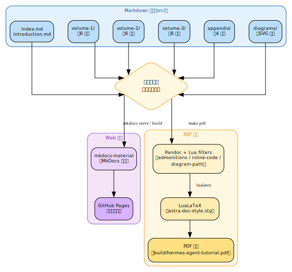

# 第十九章：Office 工具与文档撰写 {#ch:19}

## 19.1 OfficeCLI：无头 Office 文档处理

[OfficeCLI](https://github.com/alcatraz/OfficeCLI) 是一个单二进制工具，无需安装 Office 即可创建、读取和修改 `.docx`、`.xlsx`、`.pptx` 文件。

### 安装

```bash
# 下载二进制
curl -sLO https://github.com/alcatraz/OfficeCLI/releases/latest/download/officecli-linux-x64
chmod +x officecli-linux-x64
sudo mv officecli-linux-x64 /usr/local/bin/officecli
```

!!! info "参考说明"
    OfficeCLI 的完整 MCP 集成模式、视图模式、高级功能（Word/PPT/Excel 创建与编辑）在 §19.4 中有详细说明。本节仅介绍安装与基本工具链。

## 19.2 Pandoc：格式转换瑞士军刀

```bash
# Markdown → PDF
pandoc doc.md --pdf-engine=xelatex -o doc.pdf

# Markdown → DOCX
pandoc doc.md -o doc.docx

# Markdown → EPUB
pandoc doc.md -o doc.epub
```

## 19.3 TeX Live：高质量排版

通过官方镜像安装（避免发行版碎片化包管理）：

```bash
# 使用 install-tl
wget https://mirror.ctan.org/systems/texlive/tlnet/install-tl-unx.tar.gz
tar -xzf install-tl-unx.tar.gz
cd install-tl-*
sudo perl install-tl --no-interaction
```

---

## 19.4 OfficeCLI：单二进制全功能 Office 文档处理

### 19.4.1 MCP 模式集成

OfficeCLI 在 Astra 生态中以 **MCP 工具** 形式集成——Hermes Agent 通过 `mcp_officecli_officecli` 工具直接操作 Office 文档，无需离开 Agent 上下文。支持的格式：

| 格式 | 创建 | 读取 | 编辑 |
|:-----|:----:|:----:|:----:|
| `.docx` (Word) | ✅ | ✅ | ✅ |
| `.xlsx` (Excel) | ✅ | ✅ | ✅ |
| `.pptx` (PowerPoint) | ✅ | ✅ | ✅ |

### 19.4.2 核心命令

```bash
# 创建文档
officecli create report.docx

# 查看文档（多种模式）
officecli view report.docx --mode text        # 纯文本
officecli view report.docx --mode outline     # 大纲
officecli view report.docx --mode stats       # 统计信息
officecli view report.docx --mode issues      # 检测问题
officecli view report.docx --mode html        # HTML 渲染
officecli view report.docx --mode svg         # SVG 输出

# 精确操作（路径定位）
officecli get document.docx /body/p[1] --depth 2
officecli set document.docx /body/p[1] text="Updated paragraph" bold=true
officecli add document.docx /body paragraph text="New content"
officecli remove document.docx /body/p[3]
```

### 19.4.3 文档视图模式

| 模式 | 用途 | 适用场景 |
|:-----|:-----|:---------|
| `text` | 纯文本提取 | 内容审查、全文检索 |
| `annotated` | 带属性注释的文本 | 调试样式、追踪格式 |
| `outline` | 文档大纲（标题层级） | 结构审查、目录规划 |
| `stats` | 统计信息（页数、字数、图片数等） | 文档审计 |
| `issues` | 检测潜在问题 | 交付前质量检查 |
| `html` | HTML 渲染预览 | 无 Office 环境下的预览 |
| `svg` | SVG 矢量渲染 | 精确检查布局和排版 |
| `screenshot` | PNG 截图（需 headless browser） | 可视化呈现 |
| `forms` | 表单字段列表（仅 docx） | 模板审核 |

### 19.4.4 高级功能：从创建到交付

```bash
# 创建带样式的 Word 文档
officecli create tutorial.docx
officecli add tutorial.docx /body paragraph text="第一章：入门" bold=true size=19
officecli add tutorial.docx /body paragraph text="欢迎来到本教程..." size=12
officecli add tutorial.docx /body table rows=3 cols=2

# 创建 PPT（含形状、渐变）
officecli create deck.pptx
officecli add deck.pptx /slide[1] shape type=rect x=100 y=100 w=700 h=400 fill=gradient

# Excel 公式与样式
officecli create budget.xlsx
officecli set budget.xlsx /Sheet1/A1 text="项目" bold=true
officecli set budget.xlsx /Sheet1/B1 text="金额" bold=true
officecli set budget.xlsx /Sheet1/A2 text="合计"
officecli set budget.xlsx /Sheet1/B2 text="=SUM(B3:B10)"
```

## 19.5 Pandoc：文档格式转换管线

### 19.5.1 完整转换矩阵

```bash
# Markdown → PDF（含 CJK 支持、代码高亮、目录）
pandoc input.md -o output.pdf --pdf-engine=lualatex \
  --listings \
  --lua-filter=inline-code-bg.lua \
  --lua-filter=emoji-filter.lua \
  -H ~/.hermes/templates/astra-doc-style.sty \
  -V colorlinks=true -V toc=true -V toc-title="目录" \
  -V papersize=a4 -V geometry:margin=2.5cm \
  -V title="文档标题" -V subtitle="副标题" -V author="作者"

# Markdown → DOCX
pandoc input.md -o output.docx

# Markdown → EPUB
pandoc input.md -o output.epub

# Markdown → HTML (MkDocs 兼容)
pandoc input.md -o output.html --standalone --toc
```

### 19.5.2 astra-doc-style.sty 模板

Astra 生态维护了一套专业 LaTeX 模板（`~/.hermes/templates/astra-doc-style.sty`），v2.4+ 版本特性：

| 特性 | 实现 |
|:-----|:-----|
| **CJK 字体** | FandolSong（中文宋体）、FandolHei（中文黑体）—— 内置于 TeX Live |
| **英文字体** | Noto Serif（正文字体）、Noto Sans（标题无衬线）、FiraMono（代码） |
| **封面页** | 独立页面，大标题 + 副标题，居中排版 |
| **目录** | 自动生成，无衬线风格 |
| **代码块** | 浅灰背景 `#E4E4E4`，行号左对齐，语法高亮（关键字蓝、字符串绿、注释灰） |
| **标注框** | 三种预设环境：`note`（蓝边框）、`tip`（绿边框）、`warning`（橙边框） |
| **表格** | 交替行色、`booktabs` 风格细线边框、自动缩放到页面宽度 |
| **内嵌代码** | GitHub 风格浅灰背景 `\colorbox`，通过 Lua filter 处理转义 |
| **Emoji 支持** | `emoji.sty` + NotoColorEmoji 字体，Lua filter 自动转换 Unicode → `\emoji{}` |

### 19.5.3 高级 Pandoc Markdown 特性

Pandoc Markdown 原生支持许多“高级但易用”的特性，无需 LaTeX：

```markdown
# 脚注
Pandoc 有优秀的脚注支持[^1]。
[^1]: 脚注自动编号并置于页脚。

# 交叉引用（需 pandoc-crossref filter）
See @fig:architecture for details.
{#fig:architecture width=70%}

# LaTeX 数学公式
The formula $E = mc^2$ is famous.
$$
\sum_{i=1}^{n} i = \frac{n(n+1)}{2}
$$

# 图片尺寸
{width=60%}

# 管道表格
| 左对齐 | 居中 | 右对齐 |
|:-------|:----:|-------:|
| A      | B    | C      |

# 引用与参考文献（需 .bib 文件）
According to @goodman2023...
```

## 19.6 TeX Live：从官方 ISO 安装

### 19.6.1 为什么要从 ISO 安装

发行版包管理（`zypper`/`apt`）提供的 TeX Live 通常版本较旧且包碎片化。从官方 ISO 安装可获得：

- **完整 scheme-full** 方案——无需逐个安装缺失包
- **最新版本** ——2025 release
- **Fandol CJK 字体** ——内置于 TeX Live，无需系统字体配置
- **非 root 安装** ——安装到用户 home 目录

### 19.6.2 安装步骤

```bash
# 1. 挂载 ISO
sudo mkdir -p /mnt/texlive
sudo mount -o loop /path/to/texlive2025.iso /mnt/texlive

# 2. 创建安装配置文件
cat > /tmp/texlive.profile << 'EOF'
selected_scheme scheme-full
TEXDIR /home/$(whoami)/.local/texlive/2025
TEXMFCONFIG /home/$(whoami)/.texlive/texmf-config
TEXMFHOME /home/$(whoami)/texmf
TEXMFLOCAL /home/$(whoami)/.local/texlive/texmf-local
TEXMFSYSCONFIG /home/$(whoami)/.local/texlive/2025/texmf-config
TEXMFSYSVAR /home/$(whoami)/.local/texlive/2025/texmf-var
TEXMFVAR /home/$(whoami)/.texlive/texmf-var
binary_x86_64-linux 1
instopt_adjustpath 1
tlpdbopt_autobackup 0
tlpdbopt_install_docfiles 0
tlpdbopt_install_srcfiles 0
EOF

# 3. 执行安装
/mnt/texlive/install-tl --profile=/tmp/texlive.profile --no-cls

# 4. 创建符号链接
mkdir -p ~/.local/bin
for f in ~/.local/texlive/2025/bin/x86_64-linux/*; do
  ln -sf "$f" ~/.local/bin/
done

# 5. 清理
sudo umount /mnt/texlive && sudo rmdir /mnt/texlive
rm /tmp/texlive.profile
```

!!! warning "非 root 安装注意事项"
    非 root 安装无法在 `/usr/local/bin` 创建符号链接，`install-tl` 会以 exit code 1 退出——这是**正常行为**。安装本身已成功，手动创建符号链接到 `~/.local/bin/` 即可。

## 19.7 文档自动生成工作流

### 19.7.1 完整双输出管线（Web + PDF）

Astra 生态的 Hermes Agent Tutorial 本教程本身即采用此工作流。多文件 MkDocs 源码同时输出为 **网页** 和 **PDF**：



**Makefile 驱动：**

```bash
make pdf      # 生成 PDF
make serve    # 本地 Web 预览 (mkdocs serve)
make build    # 构建静态 Web (mkdocs build)
```

### 19.7.2 卷分隔符模式

使用 `_divider.md` 文件实现多卷文档的分隔：

```markdown
# _divider.md 内容：
\part*{第一卷 基础配置}
```

`_` 前缀的文件被 MkDocs 导航排除，但 pandoc 按文件顺序处理时执行 `\part*{}` LaTeX 命令。

### 19.7.3 PDF 交付前验证

编译完成后，使用 `pdftotext` 程序化验证 PDF 结构：

```bash
# 验证页面数
pdfinfo guide.pdf | grep Pages

# 查找卷分隔页
for p in $(seq 1 50); do
  text=$(pdftotext -f $p -l $p -layout guide.pdf -)
  if echo "$text" | grep -q "第一卷\|第二卷\|第三卷"; then
    echo "Vol divider on page $p"
  fi
done

# 提取所有章节标题
pdftotext -layout guide.pdf - | grep -E "^第[一二三四五六七八九十]+章"

# 检查特定页面内容
pdftotext -f 4 -l 4 -layout guide.pdf - | head -10
```

## 19.8 工具选择决策表

| 需求 | 工具 | 理由 |
|:-----|:-----|:-----|
| Markdown → PDF（任意语言，样式） | `pandoc` + `lualatex` + `astra-doc-style.sty` | **默认方案**。封面、目录、代码块行号、标注框、CJK 支持 |
| Markdown → PDF（含 emoji） | 同上 + `emoji-filter.lua` + `inline-code-bg.lua` | 需 emoji.sty + 系统 emoji 字体 |
| Markdown → DOCX / EPUB / LaTeX | `pandoc` | 原生多格式输出 |
| **读/写/改 DOCX 布局和样式** | **OfficeCLI** (MCP) | `get` 读文档树, `set` 精确修改 |
| **创建带形状/渐变的 PPT** | **OfficeCLI** (MCP) | 背景色、几何形状、位置、大小、阴影 |
| **创建带公式和样式的 Excel** | **OfficeCLI** (MCP) | SUM 公式、数字格式、单元格样式、边框、合并 |
| **修改已有 Office 文件** | **OfficeCLI** (MCP) | 路径定位到段落/形状/单元格级别 |
| 复杂中文书籍/报告 | `ctexbook` + `lualatex` 直排 | 完整排版控制 |
| 模板合并（变量填充） | **OfficeCLI** (MCP) | `merge template.docx output.json` 内建支持 |
