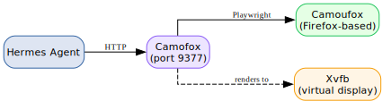
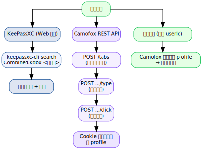

# 第20章：浏览器自动化与登录持久化（Camofox） {#ch:20}

!!! info "本章对应 Astra 生态组件"
    - [`astra-camofox-browser`](https://github.com/alrcatraz/astra-camofox-browser) — Camofox 封装
    - Camoufox/Camofox — 反检测浏览器

## 20.1 什么是 Camofox？

**Camoufox**（[daijiang1987/Camoufox](https://github.com/daijiang1987/Camoufox)）是一个基于 Firefox 的 C++ 级指纹伪装浏览器——不是简单的 JS 层面的 navigator 修改，而是在底层 C++ 代码中修改浏览器指纹。

**Camofox**（[jo-inc/camofox-browser](https://github.com/jo-inc/camofox-browser)）将前者封装为一个 REST API 服务器，为 AI Agent 提供无障碍树快照、稳定元素引用、会话隔离和代理支持。

## 20.2 典型应用场景

- **需要登录的网页**：登录后保持 Session，Agent 无需每次手动认证
- **反爬严格的网站**：模拟真实浏览器指纹
- **自动化表单填写**：持久化 Cookie 省去重复登录

## 20.3 Hermes Agent 使用 Camofox 的架构



当 Hermes 的默认 Playwright/Chromium 被 Cloudflare、反爬严格的电商平台等拦截时，Camofox 是最佳替代方案。

## 20.4 安装与容器化部署

> **Astra 生态** 提供了预配置的容器脚本，位于 `astra-camofox-browser` 仓库中。
> 安装时可直接使用 `make build && make run` 而非手动构造 Podman 命令——详见该仓库的 README。

### 20.4.1 快速起步（npx）

```bash
npx @askjo/camofox-browser --port 9377
# 首次运行自动下载 Camoufox 二进制（~300MB）到 ~/.cache/camoufox/
```

### 20.4.2 使用 Podman 部署

Astra 生态推荐使用 **Podman**（而非 Docker）进行容器化部署，以保持 rootless 安全和与 Astra 工具链一致。

**前置条件：**

| 依赖 | 用途 | 安装 |
|:-----|:-----|:-----|
| Xvfb | 无头 Camoufox 的虚拟显示 | `zypper install xvfb-run`（openSUSE） |
| Node.js >= 18 | Camofox 服务运行时 | 通常已随 Hermes 安装 |
| Firefox 系统库 | Camoufox 运行时依赖 | `libgtk-3`, `libdbus-glib`, `libxt6` 等 |

**构建与运行（含 VNC + 持久化配置文件）：**

```bash
cd astra-camofox-browser

# 下载 Camoufox 二进制（~680MB）
make fetch

# 构建镜像
make build

# 创建持久化卷
podman volume create camofox-profiles

# 启动容器
podman run -d \
  --name camofox-browser \
  -v camofox-profiles:/root/.camofox/profiles \
  -p 5900:5900 \
  -p 9377:9377 \
  -e ENABLE_VNC=1 \
  -e BROWSER_IDLE_TIMEOUT_MS=0 \
  localhost/camofox-browser:135.0.1-x86_64-vnc

# 验证
curl -s http://localhost:9377/health
# Expected: {"ok":true,"engine":"camoufox","browserConnected":true,...}
```

## 20.5 Hermes 配置

在 `~/.hermes/.env` 中设置：

```bash
CAMOFOX_URL=http://localhost:9377
```

Hermes 的浏览器工具集自动检测此环境变量——无需在 `config.yaml` 中修改 `browser.engine`。

Camofox 选项：

| 环境变量 | 默认值 | 说明 |
|:---------|:-------|:-----|
| `CAMOFOX_PORT` | `9377` | 监听端口 |
| `CAMOFOX_API_KEY` | _(无)_ | 可选鉴权密钥 |
| `CAMOFOX_PROXY_URL` | _(无)_ | 住宅代理 URL（增强反检测） |

## 20.6 登录凭据持久化与会话管理

### 20.6.1 核心挑战：跨轮次会话保持

**关键限制：** Hermes 在每个消息轮次之间清理浏览器会话。这意味着跨轮次的登录流程（输入手机号 → 等待验证码 → 输入验证码 → 登录）**不能依赖 Hermes 的浏览器工具**——会话在下一轮就消失了。

解决这个问题的关键是 **持久化浏览器配置文件**——将登录状态（Cookie、LocalStorage、Session）写入磁盘，使同一站点的后续访问能够复用已验证的会话。

### 20.6.2 配置文件持久化机制

Camofox 将浏览器状态保存到 `~/.camofox/profiles/<hash>/storage-state.json`：

| Cookie 类型 | `expires` 值 | 容器重启后？ |
|:------------|:-------------|:------------|
| Session Cookie（如 `cookie2`, `_tb_token_`） | `0` / `-1` | ❌ 丢失 |
| Persistent Cookie（如 `t`, `tfstk`） | 未来时间戳 | ✅ 有效直至过期 |

**持久化策略：**

1. **首次登录** — 使用 Hermes 的 credential 系统（[见第15章](../volume-3/15-credentials.md)）获取网站凭据，通过 Camofox REST API 执行登录，浏览器 profile 自动持久化 Cookie
2. **后续访问** — 指定相同的 `userId` / `sessionKey`，Camofox 自动从磁盘加载 profile，恢复已登录状态
3. **定期刷新** — 对于 session-only Cookie 的站点，通过 cron 定期执行凭据登录刷新会话

### 20.6.3 通过 Camofox REST API 持久化会话

由于 Hermes 的浏览器工具在每轮后清理会话，需要直接调用 Camofox REST API（通过 `execute_code()` 或 `terminal()` 中的 curl）来维持跨轮次的登录状态：

| 操作 | 方法 | URL | 参数 |
|:-----|:-----|:----|:-----|
| 创建标签页 | `POST /tabs` | `http://localhost:9377/tabs` | `{"url":"...","userId":"X","sessionKey":"..."}` |
| 获取页面快照 | `GET /tabs/{tabId}/snapshot?userId=X` | — | — |
| 点击 | `POST /tabs/{tabId}/click` | — | `{"userId":"X","ref":"e5"}` |
| 输入文本 | `POST /tabs/{tabId}/type` | — | `{"userId":"X","ref":"e2","text":"..."}` |
| 导航 | `POST /tabs/{tabId}/navigate` | — | `{"userId":"X","url":"..."}` |
| 截图 | `GET /tabs/{tabId}/screenshot?userId=X` | — | — |
| 清理 | `DELETE /sessions/{userId}` | — | — |

**关键注意事项：**

- `userId` 在 GET 端点中放 **query params**，在 POST 端点中放 **JSON body**
- 为每个站点/账号创建固定的 `userId` 和 `sessionKey`，确保登录状态持续有效
- 标签页持续存在直到显式删除或 Camofox 服务重启

### 20.6.4 从凭据管理系统读取登录信息

Camofox 的登录凭据应通过[第15章](../volume-3/15-credentials.md)描述的凭据管理系统获取：



### 20.6.5 登录状态验证

```python
import requests

CAMOFOX = "http://localhost:9377"
USER_ID = "site_monitor_prod"

# 创建标签页并检查是否已登录
resp = requests.post(f"{CAMOFOX}/tabs", json={
    "url": "https://example.com/account",
    "userId": USER_ID,
    "sessionKey": "persistent_session"
})
tab_id = resp.json()["tabId"]

# 获取页面 snapshot 验证登录状态
snap = requests.get(f"{CAMOFOX}/tabs/{tab_id}/snapshot",
    params={"userId": USER_ID}).json()

# 检查 snapshot 中是否出现"登录"按钮（→ 未登录）或"我的账户"（→ 已登录）
is_logged_in = "my account" in str(snap).lower()
```

### 20.6.6 定期刷新策略

对于 Session Cookie 有效期较短的站点，通过 cron 定期执行凭据登录：

| 调度 | 操作 | 凭据来源 |
|:-----|:-----|:---------|
| 每日 06:00 | 刷新所有网站登录 | KeePassXC → Camofox |
| 容器重启后 | 自动恢复 profile 登录 | profile 磁盘文件 |
| Session 过期时 | 自动检测 → 重新登录 | KeePassXC 凭据查询 |

## 20.7 反检测浏览器策略全景

| 方法 | 可靠性 | 安装成本 | 状态 |
|:-----|:-------|:---------|:-----|
| Camofox 浏览器 | ✅ 高 | 中等（容器部署） | 推荐 |
| 无头浏览器直连 | ❌ 被封锁 | 低 | 不可行 |
| 代理 + 普通浏览器 | ⚠️ 中等 | 中等 | 与用户使用同一个浏览器进程 |

对于反爬严格的平台，Camofox 配合持久化凭据管理是当前 Astra 生态的推荐方案。

---
