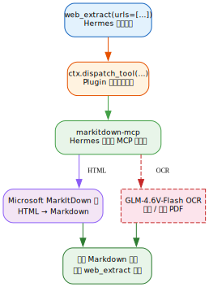

\\newpage

# 第20章：MarkItDown MCP 作为网页提取后端 {#ch:20}

!!! info "本章对应组件"
    - [`astra-web-extract-markitdown`](https://github.com/alrcatraz/astra-web-extract-markitdown)
    - `markitdown-mcp`（微软官方 MCP 服务器）

## 背景

Hermes 内置的 `web_extract` 工具需要 Firecrawl、Tavily 或 Exa 等付费 API 后端。
`astra-web-extract-markitdown` 插件通过 `ctx.dispatch_tool` 将调用路由到已有的
markitdown-mcp 服务器，实现**零外部依赖**的网页提取。

## 架构



## 前提条件

```bash
# 1. markitdown-mcp 已安装
uv tool install markitdown-mcp

# 2. 配置 MCP 服务器（~/.hermes/config.yaml）
mcp_servers:
  markitdown:
    command: markitdown-mcp
    enabled: true
    timeout: 60
```

## 安装插件

### 用户模式
```bash
git clone https://github.com/alrcatraz/astra-web-extract-markitdown.git \
  ~/.astra/repos/astra-web-extract-markitdown
ln -sfn ~/.astra/repos/astra-web-extract-markitdown/plugin \
  ~/.hermes/plugins/web-extract-markitdown
hermes plugins enable web-extract-markitdown --allow-tool-override
```

### 开发者模式
```bash
git clone https://github.com/alrcatraz/astra-web-extract-markitdown.git \
  ~/Projects/astra/astra-web-extract-markitdown
git clone ~/Projects/astra/astra-web-extract-markitdown \
  ~/.astra/repos/astra-web-extract-markitdown
# 建立软链接
ln -sfn ~/.astra/repos/astra-web-extract-markitdown/plugin \
  ~/.hermes/plugins/web-extract-markitdown
```

---
