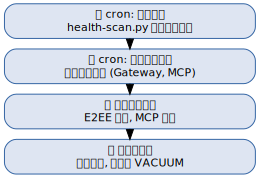

# 第二十章：个人设备健康检测与自动维护（SRE） {#ch:20}

!!! info "本章对应 Astra 生态组件"
    - [`astra-sre`](https://github.com/alrcatraz/astra-sre) — 统一 SRE 协调层
    - Service Inventory — 服务清单与健康检查

## 20.1 为什么需要个人 SRE？

单机运维常常被忽视——出了问题再临时修复。Astra SRE 的思路是将**生产环境的可靠性实践**引入个人设备管理：

- **主动巡检**：每日自动检查所有设备
- **看门狗机制**：核心服务实时监控
- **自动修复**：常见故障自动处理

## 20.2 SRE 的层次架构



---

## 20.3 设备清单管理

Astra SRE 通过 `config/devices.yaml` 管理所有设备。设备的登录凭据（SSH 密码、sudo 密码）**不直接存储在该文件中**——它们通过 `~/.astra/credentials/*.yaml.gpg` 文件读取（[见第十五章](#ch:15) §15.4 的系统二）：

```yaml
# astra-sre/config/devices.yaml.example
devices:
  - name: homeserver
    ssh: admin@10.0.1.10:2222
    key: id_ed25520
    checks:
      - systemd: nginx,docker,postgresql
      - disk_warn: 85
      - disk_crit: 92

  - name: workstation
    ssh: localhost
    checks:
      - systemd: hermes-agent,podman,postgresql
```

!!! note "凭据分离原则"
    `devices.yaml` 中仅配置 SSH 密钥路径（`key` 字段）和连接方式。SSH 密码和 sudo 密码存储在 `~/.astra/credentials/*.yaml.gpg` 中（[见第十五章](#ch:15) §15.4）。health-scan.py 运行时从 GPG 加密的 credentials 文件中读取凭据。

设备访问矩阵示例：

## 20.4 每日健康巡检

### 20.4.1 health-scan.py

核心巡检脚本位于 `astra-sre/scripts/health-scan.py`。一次运行 SSH 到所有配置设备，收集：

- **磁盘使用率** — 阈值告警（默认 warn=85%, crit=92%）
- **内存使用率** — 阈值告警（warn=80%, crit=92%）
- **系统负载 & 运行时间**
- **关键服务状态** — 可配置的 systemd 服务列表检查
- **网络可达性** — ping 检查

**凭据读取：** 巡检脚本通过 `~/.astra/credentials/*.yaml.gpg` 读取 SSH 密码和 sudo 密码（[见第十五章](#ch:15) §15.4），不在脚本或配置文件内存储任何明文密码。

**运行方式：**

```bash
# 进入仓库目录，使用 uv run 确保依赖隔离
cd astra-sre
uv run python3 scripts/health-scan.py

# 只输出摘要（适合快速浏览）
uv run python3 scripts/health-scan.py --brief

# JSON 格式（供脚本消费）
uv run python3 scripts/health-scan.py --output json
```

报告格式示例：

```
📊 astra-sre 全设备巡检 · 2026-06-20 08:00

  ✅ homeserver · 负载:0.12,0.08,0.06 · 磁盘:34% · 内存:45% · 运行:12 days
  ✅ workstation · 负载:0.05,0.03,0.01 · 磁盘:28% · 内存:38% · 运行:30 days
  ⚠️ dev-server · 负载:0.80,0.75,0.70 · 磁盘:88% · 内存:72% · 运行:5 days

📋 巡检摘要
  🟡 P2 (1 项)
    · dev-server: 磁盘 88%
  🔵 P3 (1 项)
    · dev-server: 磁盘 88%
```

### 20.4.2 Cron 调度

巡检 cron 配置：

| 字段 | 值 |
|:-----|:----|
| Job ID | `e6d8320767aa` |
| 名称 | `astra-sre 每日巡检` |
| 调度 | `0 8 * * *`（每日 08:00 HKT） |
| 模式 | `no_agent`（脚本 stdout 直接投递，无 LLM 中转） |
| Workdir | `astra-sre/`（仓库根目录） |
| 投递目标 | Home room 📊 线程 |

**关键设计决策 — 为什么用 `no_agent` 模式？**

原始 cron 是 LLM 驱动的（agent → `terminal()` → 脚本 → 管道 → LLM → 回复）。自 2026-06-20 起，每次运行均失败，根因是 `RuntimeError: [Errno 32] Broken pipe`——脚本执行期间（扫描多台设备），agent 的 stdout 管道超时关闭。转换为 `no_agent=true` 后，脚本作为独立子进程运行，stdout 直接投递，零 LLM 开销、零管道断裂风险。

调用 wrapper 脚本 `~/.hermes/scripts/astra-sre-scan.sh`：

```bash
#!/bin/bash
set -euo pipefail
REPO_DIR="$HOME/astra-sre"
cd "$REPO_DIR"
unset VIRTUAL_ENV          # 防止 Hermes venv 泄漏到 uv
exec uv run python3 scripts/health-scan.py
```

### 20.4.3 运行时选择原则

| 任务类型 | 模式 | 理由 |
|:---------|:----:|:-----|
| 跑脚本 → 直接投递 stdout | `no_agent` | 纯机械任务，LLM 无增量价值 |
| 汇总数据、决策报告内容 | `agent`（LLM 驱动） | 需要 LLM 判断力 |

## 20.5 服务级健康检查（每小时）

服务级健康检查由 `service-inventory` skill 管理，与 astra-sre 的**设备级**巡检是**不同层次**的监控：

| 层 | 拥有者 | 间隔 | 检查内容 | 模式 |
|:---|:-------|:-----|:---------|:----:|
| 设备级 | astra-sre | 每天 08:00 | 磁盘、内存、负载、可达性 | `no_agent` |
| 服务级 | service-inventory | 每小时 | MCP、API、数据库、Gateway | `no_agent`（正常时静默） |

服务健康检查脚本 `healthcheck.py`（位于 `service-inventory/scripts/`）检查以下服务：

| 服务 | 检查方式 | 预期状态 |
|:-----|:---------|:---------|
| SearXNG | `curl http://127.0.0.2:8931/search` | HTTP 200 |
| PostgreSQL | `pg_isready` | accepting connections |
| DeepSeek API | `curl https://api.deepseek.com/v1/models` | HTTP 200 |
| Astra KB MCP | 文件存在检查 | server.py exists |
| markitdown MCP | 二进制存在检查 | installed |
| time MCP | `pgrep` 进程存活 | running |

结果写入 `service_mgmt` 知识库，异常时通过 Gateway 发送通知。

## 20.6 月度维护

每月 1 日运行的维护脚本 `astra-sre-refresh.sh`（`no_agent`，静默运行）：

```bash
cd astra-sre

# 1. 刷新参考数据
python3 scripts/kb_access.py --refresh

# 2. 运行学习循环（“两次原则”模式检测）
python3 scripts/learn.py --cron

# 3. 数据库 VACUUM（如果使用 SQLite）
sqlite3 /path/to/knowledge-base.db "VACUUM;"
```

`learn.py --cron` 按 **"两次原则"** 工作：扫描 `sre_incidents` 知识库，寻找出现 2 次以上且缺少对应 sub-skill 的问题模式，自动生成 SKILL.md 模板建议。

已通过 learn.py 自动生成的 sub-skill：

| Sub-skill | 级别 | 来源 |
|:----------|:----:|:-----|
| astra-sre-fix-gfw | L2 | 两次 GFW 事故后自动生成 |
| astra-sre-fix-mcp | L2 | 两次 MCP 事故后自动生成 |
| astra-sre-fix-vps-recovery | L2/L3 | 两次 VPS 恢复后自动生成 |

## 20.7 分层修复机制

Astra SRE 的修复操作按影响级别分为三层：

| 级别 | 说明 | 例子 | 是否需要确认 |
|:----:|:-----|:-----|:----------:|
| **L1** | 无服务影响，完全自动 | 配置修改、缓存清理、通知重放 | ❌ 自动执行 |
| **L2** | 短暂/可选服务影响 | 重启非关键服务、只读诊断 | ✅ 自动+通知 |
| **L3** | 不可逆或高风险 | 数据删除、Token 更换、服务重建 | 🔴 必须人工确认 |

所有自动修复步骤都必须有 **验证探针**（verify probe），复用 `health-scan.py --json` 对比修复前后的状态。如果状态恶化 → 触发回滚或升级到 L3。

**并发保护：** 使用锁文件 `/tmp/astra-sre-lock-<tag>.lock`（含 PID + 时间戳），通过 `kill -0 <PID>` 检测活锁。旧 PID 已死 → 自动清除（处理 SIGKILL / 崩溃残留）。按事故标签锁定，防止看门狗和诊断脚本互相踩踏。
