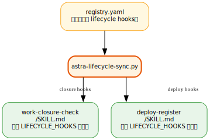
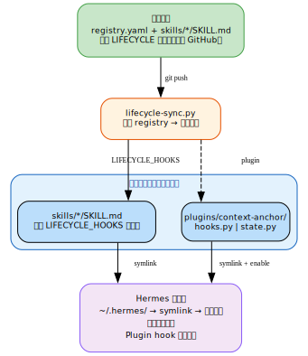

# 第23章：开发者指南 {#ch:23}

!!! note "面向读者"
    如果你想为 Astra 生态贡献新组件、开发自定义 Skill/Plugin/MCP 服务，本章提供完整的开发标准参考。

## Skill 开发

### SKILL.md 格式

```yaml
---
name: astra-<domain>-<name>
description: "<一句话描述>"
version: 1.0.0
author: <你的 GitHub 用户名>
platforms: [linux]
---
Skill正文
```

- name 必须 `astra-` 前缀 + kebab-case
- 版本号遵循语义化版本 2.0.0

### 触发条件

使用汉英双语的触发关键词，让 Hermes 在遇到相关任务时自动加载该 skill。

## Plugin 开发

Hermes 的 plugin 系统支持 `override=True` 替换内置工具。详见[官方文档](https://hermes-agent.nousresearch.com/docs/guides/build-a-hermes-plugin/)。

### Plugin 结构

Plugin 目录包含以下文件，每个文件有明确的职责划分：

| 文件 | 用途 |
|:-----|:------|
| `plugin.yaml` | 清单文件 |
| `__init__.py` | `register(ctx)` 注册接口 |
| `hooks.py` | 生命周期钩子实现 |
| `schemas.py` | 工具 schema 定义 |
| `tools.py` | 工具逻辑实现 |
| `state.py` | 状态持久化 |

Plugin 通过注册生命周期钩子与 Hermes 运行时交互：

| 钩子 | 触发时机 | 典型用途 |
|:-----|:---------|:---------|
| `pre_llm_call` | LLM 调用前 | 修改系统提示词 |
| `post_tool_call` | 工具调用后 | 记录 SSH 跳转、更新状态 |
| `pre_tool_call` | 工具调用前 | 阻断违反原则的操作 |
| `on_session_start` | 新会话开始 | 重置状态到初始值 |

### 关键：override=True

替换内置工具需要在 `register()` 中传入 `override=True`：
```python
ctx.register_tool(
    name="web_extract",
    toolset="plugin_web_extract",
    schema=schemas.WEB_EXTRACT,
    handler=tools.web_extract,
    override=True,
)
```

启用时需授权：
```bash
hermes plugins enable <name> --allow-tool-override
```

### 状态持久化

每个插件应在 `~/.hermes/persistent/` 下维护独立的状态文件，避免与其他插件冲突：

```python
PERSISTENT_DIR = Path.home() / ".hermes" / "persistent"
STATE_FILE = PERSISTENT_DIR / "<plugin-name>.json"
```

Hermes 内核在会话重置时会自动恢复 `persistent/` 目录，因此状态可跨会话存活。
如需检测跨会话残留，可在读取时校验 `session_id` 字段：

```python
def get() -> dict:
    state = json.load(open(STATE_FILE))
    stored_sid = state.get("session_id")
    current_sid = os.environ.get("HERMES_SESSION_ID")
    if stored_sid and current_sid and stored_sid != current_sid:
        state = default_state()
        state["session_id"] = current_sid
        _write(state)
    return state
```

## MCP 服务开发

MCP 服务是独立的进程，通过 stdio 或 HTTP 与 Hermes 通信。
详见[官方 MCP 文档](https://hermes-agent.nousresearch.com/docs/user-guide/features/mcp)。

## lifecycle-sync：自动标记注入

`astra-lifecycle-sync` 是 `astra-aiagent-infra/lifecycle/` 下的同步工具，负责将 registry 中声明的 lifecycle hooks 自动注入到对应的 SKILL.md 文件中。

### 工作原理

1. 各组件在 `registry.yaml` 中声明自己的 lifecycle hooks（如 `closure_hooks`, `deploy_hooks`）
2. `astra-lifecycle-sync.py` 读取 registry，找到每个组件的声明
3. 通过 `<!-- LIFECYCLE_HOOKS_BEGIN -->` / `<!-- LIFECYCLE_HOOKS_END -->` 标记将 hooks 注入到对应的 SKILL.md



这样，deploy-register 和 work-closure-check 的检查清单可以**从 registry 声明自动生成**，而非手动维护。

```bash
cd ~/.astra/repos/astra-aiagent-infra
python3 lifecycle/astra-lifecycle-sync.py --update
```

### 何时运行

- **首次部署后**：初始化所有 SKILL.md 的 hooks 标记
- **修改 registry.yaml 后**：将新的 hook 声明写入对应的 SKILL.md
- **升级组件后**：确保 hooks 标记与最新 registry 一致

## 部署管线与双副本工作流

Plugin 和 Skill 的完整部署遵循"清洁 dev → 同步 → 私密运行时"原则：



### 双副本结构

| 位置 | 角色 |
|:-----|:------|
| `~/Projects/astra/<component>/` | 开发副本，可推送 GitHub（需脱敏） |
| `~/.astra/repos/<component>/` | 私有副本，Hermes 实际加载 |
| `~/.hermes/plugins/<name>/` 或 `~/.hermes/skills/<domain>/<name>/` | 软链接，指向私有副本 |

### 日常同步流程

开发副本修改完成后，同步到私有副本：

```bash
cd ~/Projects/astra/<component>
git push origin main                # push dev → GitHub
cd ~/.astra/repos/<component>
git pull origin main                # pull GitHub → private

# 如涉及 lifecycle hooks，刷新标记
cd ~/.astra/repos/astra-aiagent-infra
python3 lifecycle/astra-lifecycle-sync.py --update
```

### 脱敏要求

开发副本推送 GitHub 前需检查：

- 无本地路径硬编码（`/home/...`、`/Users/...`）
- 无个人凭证（API key、token、密码）
- 无本地配置（本机的 `.env`、`config.yaml` 特定值）

## Astra 生态标准

所有组件必须遵守 [`astra-aiagent-infra/docs/module-development-guide.md`](https://github.com/alrcatraz/astra-aiagent-infra) 中的标准：

| # | 检查项 | 说明 |
|:-:|:-------|:-----|
| 1 | README.md | 存在，含 Badge Bar + 双语 |
| 2 | SKILL.md | 含 YAML frontmatter |
| 3 | LICENSE | MIT |
| 4 | registry.yaml | 已在 meta-repo 注册 |
| 5 | 版本一致性 | registry + 本地一致 |
| 6 | Hub 索引 | 在 astra-hub 中列出 |
| 7 | routing.yaml | 如需 execution-framework 自动发现 |

---
